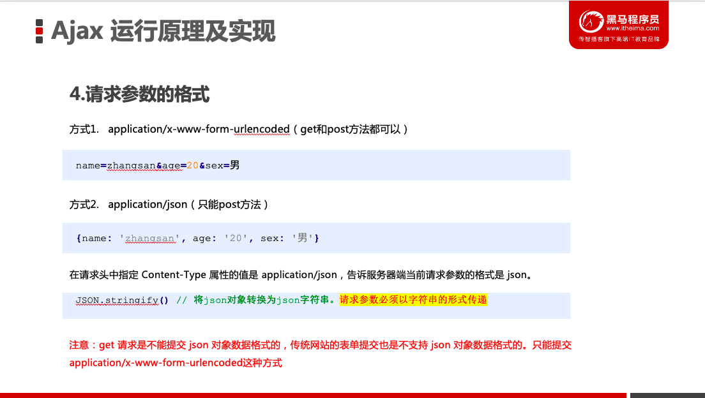

###  一、JS基本介绍

#### 1.js什么情况？

1.1 出生日期：JavaScript在1995年
1.2 为什么js出来了（提升用户体验）
1.3 设计js花费了不到半个月

借鉴：java、c++。
**【重要】**思考：js很多地方和java以及c++比较像。 *********
【**重要**】BUG：js，问题特别多。				 *********

#### 2.js到底是什么？

​	作者创造js的思路 ：简单易上手

​	2.1 **【重要】**JavaScript 基于原型编程脚本语言（记住）	***********

#### 3.试一试js

3.1 使用方式（引入方式）

3.1.1 嵌入

```HTML
<script type="text/javascript">
	//这里是js代码
</script>
```
3.1.2 引入

```javascript
<script type="text/javascript" src='js/a.js'></script>
```

3.1.3 **【重要】**延迟和异步加载js

	defer属性 ==》延迟
	
		注：所有的defer脚本保证是按顺序依次执行的。defer是文档加载完毕了再执行脚本
	
	async属性 ==》异步
	
		不能保证脚本会按顺序执行,哪个脚本先加载完，先执行谁。

注意：有些上线后javascript代码会乱码，这种情况下要script标签上加上uft-8字符集 <script charset="utf-8">

【面试题-大厂爱问重要】JS延迟加载的方法有哪些？******
	<script defer></script>
	<script async></script>

#### 4.一些js代码

alert()  		        =>  弹出框
console.log()      =>  弹出框    ：  排错     

.  可以理解成  的
;  				         ===>  分号结尾每一句话 

#### 5.js注释

单行注释:  //
多行注释:  /*   

​                    */

5.1 公共组件维护者和各栏目WD都需要在文件头部加上注释说明

```
	 /**
 		* 公共js文件：做什么事
 		* 姓名：章三
		* 修改日期：2020-11-23
	  **/
```

5.2 单行注释（写在上面，后端都写在下边）

```
//弹出内容 ： 姓名; 
	alert('小秦')
```

5.3 大的模块注释

```
//================
// 生成订单请求  80 - 163
//================
```


### 二、变量 

变量是用于存放数据的容器

1. 变量的命名规范：（JS提出）

   1. 首位：字母、下划线、$

   ​			日常：字母
   ​			key值：app_id
   ​			$：定义一个常量

   2. 严格区分大小写

   3. 规范：采用驼峰命名（第一个单词开始之后每一个单词首字母大写） 

   4. 不能以数字开头 ，但是命名中可以包含数字

   5. 命名必须有意义

   6. 不能是保留字和关键字

2. 声明变量: var 

3. = : 赋值

   

### 三、数据类型

​		3.1 基本数据类型 （原始数据类型）

​			string（字符串） :  基本上加入引号的都是字符串
​			number（数值） :  正数、负数、小数 
​			boolean(布尔)       :  有2个值：true、false
​										   	   true(对)
​										      	false(错)

​			undefined(未定义)	:  表示“缺少值”。应该是有一个值，但是还没有赋值

​			null（空对象）    :  标示“没有对象”。该处不应该有值

​		3.2 引用数据类型:对象（后面再说）

​							object

​		3.3 检测数据类型：typeof

​				语法：
​					typeof str 
​					typeof(str)

```js
        var nulls = null
        console.log(typeof null) // ==》object
```

​			

【面试题】undefined和null的区别*************

1.1 作者在设计js的时候，结合java和C++，就先设计出来了null。
1.2 在c++里面null自动转化数据类型为0
1.3 作者觉得表示"无"的值最好不是对象(null)

设计null和undefined的原因：

​		1.null像在Java里一样，被当成一个对象。但是，JavaScript的数据类型分成原始类型（primitive）和合成类型（complex）两大		类，作者觉得表示"无"的值最好不是对象。

​		2.JavaScript的最初版本没有包括错误处理机制，发生数据类型不匹配时，往往是自动转换类型或者默默地失败。作者觉得，如		果null自动转为0，很不容易发现错误。

​		因此，作者又设计了一个undefined。


### 四、数据类型的转换

​		4.1 其他类型转换成  “字符串类型”

​				a> 数据.toString()  ： 优先使用 (数字型、布尔型转换成字符串，null，undefined转换会报错)

​				b> String(数据)     ： 强行转换(数字型、布尔型，null，undefined都会强制转换成字符串)

​				c> 隐式转换：加号拼接字符串，和字符串拼接的结果都是字符串

​		4.2 其他类型转换成  “数值类型”

​				a> Number(数据)： 强行转换 (将“”、“ ”转换成0、true转换成1、false转换成0、null转换成0、undefined转换NaN)（少用）

​				b> parseInt(数据)	： 优先使用 (将“”、“ ”、true、false、null、undefined都转换为NaN) （将String转换成数字，其余都为																																																						NaN）

​														eg：999元加parseInt()就会自动去掉元字， parseInt()有一个功能可以把数字后缀去掉

​				c> parseFloat(数据)	： 优先使用 (将“”、“ ”、true、false、null、undefined都转换为NaN)（将String转换成数字，其余都为																																																						NaN）

​				d>隐式转换 ： * / % -  都会转换成数字类型

​					Int和Float区别
​						int是整数
​						Float可以有小数

​			******NaN代表什么：是数值类型，但是不是一个具体的数字

​			4.3 其他类型转换成   “布尔类型”

​					a> Boolean(数据)

​			数值：

​					'' -> false

​					0 -> false
​					NaN -> false

​					null -> false

​					undefined -> false

​					其他 -> true

​			字符串:
​					非空即为true  ，true为1

​					空为false   ，false为0

​					空格也是true

​		4.4 隐引转换

​					1> 布尔和数值相加(+) ， 布尔会自动转换成数值类型

​							true  =>1
​							false =>0

​					2> 字符串和任何类型相加(+)，其他类型都会自动转换成字符串类型

​							注意：除了+以外，其他的都是按照数值进行运行的

​					3> 字符串连加号===> 结果为字符串

​						布尔、null、数字、undefined连加号 ===> 布尔、null、数字、undefined都会转换成数值型，但undefined不是一个具体																									的数字，是NaN

​					

### 五、js企业规范

​		1.引号的使用

​				在没有拼接的情况，引号都用单引号（但引号中间嵌套双引号）

​		2.变量命名

​				字符串类型：s开头
​				数字类型  ：n开头
​				布尔类型  ：b开头

​				数组      ：a开头
​				正则      ：r开头
​				函数      ：f开头
​				对象      ：o开头


### 六、变量的存储机制原理

1》内存（浏览器引擎 、 内存条）（先存储在浏览器引擎中再存储到内存条中）
2》内存生命周期（三个周期）

​	分配期：分配所需要的内存
​	使用期：读、写操作
​	释放期：不需要时将其释放

​	内存分配=》内存使用=》内存释放

3》javascript内存的生命周期

​	内存分配：分配你所需要的暂时使用内存大小
​	内存使用：读、写内存
​	内存回收：对于不需要使用的内存将其释放

4》栈内存、堆内存

​	栈内存：

​		1、基本类型（string、number、boolean、undefined、null）
​		2、按值访问（在存储时变量中存储的是值，按值存储）
​		3、存储的值大小固定
​		4、系统会自动分配内存空间 ( 先到浏览器再到内存 )
​		5、空间小、运行效率高（笑笑得了）
​		6、先进后出

​	堆内存：

​		1、引用类型（object）
​		2、按引用访问（在存储时变量中存储的仅仅是**地址**（引用））
​		3、存储的值大小不固定
​		4、由代码进行执行分配
​		5、空间大、运行效率相对较低（笑笑得了）
​		6、无序存储（根据引用直接获取）


5》简单数据类型传参、引用数据类型传参

​					简单数据类型传参：函数的形参也可以看做是一个变量，当我们把一个   **值类型变量**   作为参数传给函数的形参时，其实是把变量在栈空间里的值复制了一份给形参，那么**在方法内部对形参做任何修改，都不会影响到的外部变量。**

​					引用数据类型传参：函数的形参也可以看做是一个变量，当我们把   **引用类型变量**   传给形参时，其实是把变量在栈空间里保存的堆地址复制给了形参，形参和实参其实保存的是同一个堆地址，所以操作的是同一个对象。

 

```javascript
// 简单数据类型传参
        function fn(a) {
            a++;
            console.log(a);
        }
        var x = 10;
        fn(x); // 11
        console.log(x); // 10

// 复杂数据类型传参
        function Person(name) {
            this.name = name;
        }

        function f1(x) { // x = p
            console.log(x.name); // 2. 这个输出什么 ?  刘德华   
            x.name = "张学友";
            console.log(x.name); // 3. 这个输出什么 ?   张学友
        }
        var p = new Person("刘德华");
        console.log(p.name); // 1. 这个输出什么 ?   刘德华 
        f1(p);
        console.log(p.name); // 4. 这个输出什么 ?   张学友
```


```javascript
var arr1 = [1,2,3];
var arr2 = [1,2,3];
console.log( arr1 == arr2); // false
```


```javascript
			var arr1 = [1,2,3];

			var arr2 = arr1;

			console.log(arr1 == arr2) // true
```


### 七、运算符

#### 7.1 算术运算符【运算】

+-*/ %

数据类型“隐引转换”

​	*********注意：除了+以外，其他的都是按照数值进行运行的

​	*********不要直接判断两个浮点数是否相等

​				浮点数的精确度：浮点数值的最高精度是 17 位小数

```javascript
var result = 0.1 + 0.2; // 结果不是 0.3，而是:0.30000000000000004 
console.log(0.07 * 100); // 结果不是 7， 而是:7.000000000000001
```


#### 7.2 赋值运算符【运算】

​	=  +=  -=   *=  /=  %=

​	num1 += num2  ===> num1 = num1 + num2 


#### 7.3 比较运算符  ： 返回的结果是布尔类型【判断用】

​	== 			等于：比较值

​	=== 		全等：值和类型都要进行比较

​	********* 不怎么准确：如果是引用类型，要看引用地址
​	
​	!=			非等

​	!== 		非等（类型和值）

​	<  >=  <=


************  【要点】  ************

【知道，记一下】JS一切事物皆对象


************  【补充】  ************

confirm("请按按钮");   ： 有确定和取消的系统弹出框

prompt("sometext","defaultText");  ：用户输入框

isNaN(数据)  用于检查数据是否是非数字值。

​			数字     ==》false
​			不是数字  ==》true
​			常使用	!isNaN


#### 7.4一元运算符（一目运算符）

++i : 【理解】：先喝点东西，在干活
i++ : 【理解】：先干活，最后喝点东西

--i
i--

********注意i是一个变量，是我的瞎写的。

规则：
  【如果不参与运算】，++在前面和后面结果都是一样(+1)
	如果有运算，++在前面(++i)，则表示：先自身+1，再运算
	如果有运算，++在后面(i++)，则表示：先运算，再自身+1

例题：

```javascript
// eg1:
var num = 1;
var sum = ++num + ++num;
console.log(num, sum); // 3 5

//eg2:
var num = 1;
var sum = num++ + num++;
console.log(sum, num); //  3  3

// eg3:
var num = 1;
var sum = ++num + num++;
console.log( sum ,num ); // 4, 3

// eg4:
var num = 1;
var sum = ++num + ++num + num++ + ++num;2+3+3+5
console.log(sum, num); // 13 5

// eg5:
var num = 10;
var sum = ++num + 10 + ++num + num++;
console.log(sum, num); // 45 13
```


#### 7.5二元运算符

&& (与)

1. 语法格式:（一般来说项目里最后3层）

	 表达式 && 表达式

2. 规则：

	1. 【值】如果(左侧表达式)判断是false，则返回(左边表达式的值)，否则返回（右边表达式）的值。
	2. 【表达式】都成立，返回true，有一侧不成立整体返回false

```javascript
console.log(1 && 2); // 2
console.log(0 && 2); // 0
console.log(1 > 0 && 2 > 5); // false
console.log(false && 3); // false
console.log(true && 4); // 4
```

|| (或)

 1. 语法格式：（一般来说项目里最后3层）

    ​	表达式 || 表达式

    2. 规则：

       1.【值】如果（左侧表达式）判断为true，则返回（左侧表达式）的值，
        	否则返回（右侧表达式）的值

       2.【表达式】只要有一侧为true，就整体返回true

```javascript
console.log(false || true); // true
console.log(1 > 5 || 6 > 5); // true
console.log(false || 4); // 4
console.log(false && 3 || true && 4); // 4
```

！ (非)  ===》去反 ： 返回布尔类型


#### 7.6 三元运算符 (判断)

语法格式：  条件 ? 结果1 ：结果2

如果条件成立(true)，执行结果1，否则执行结果2

#### 7.7 运算符优先级

| 优先级 | 运算符     | 顺序                 |
| ------ | ---------- | -------------------- |
| 1      | 小括号     | （）                 |
| 2      | 一元运算符 | ++ -- ！             |
| 3      | 算术运算符 | 先* / %后 + -        |
| 4      | 比较运算符 | >= <= < >            |
| 5      | 相等运算符 | ==    !=   ===   !== |
| 6      | 逻辑运算符 | 先&&  后｜｜         |
| 7      | 赋值运算符 | =                    |
| 8      | 逗号运算符 | ，                   |

- 一元运算符里面的逻辑非优先级很高
- 逻辑与&&比逻辑或||优先级高

### 八、流程控制语句(if)

8.1 if语句

语法格式：

​			if(条件){
​				条件成立，执行这里代码
​			}else{
​				条件不成立，执行这里代码
​			}

多条件：

​			if(条件1){
​				如果条件1成立时，执行这里代码
​			}else if(条件2){
​				如果条件2成立时，执行这里代码
​			}else if(条件3){
​				如果条件3成立时，执行这里代码
​			}
​			....
​				else{
​				如果以上条件都不满足，执行这里代码
​			}

⚠️【注意】：

******** undefind和null转换成布尔都是false，判断会走else ************

写法：
	if( a == b ){     ===》 if( a==b ) alert('q');
		alert('q');
	}

```javascript
 if( true ){
 		alert(1);
}else{
		alert(2);
} // 弹出1
 
 if( -1 ){
	 	alert(1);
 }else{
		alert(2);
 } // 弹出1

if (undefined) {
     alert(1);
} else {
     alert(2);
} // 弹出的是2


if (null) {
     alert(1);
} else {
     alert(2);
} // 弹出2
```


8.2 流程控制语句(if嵌套)

​	if( 条件 ){

​		如果条件成立，执行这里代码

​	if( 条件 ){

​		如果条件成立，执行这里代码
​	
​	}else{

​		如果不成立，执行这里代码
​	
​	}

​	}else{

​		如果不成立，执行这里代码

​	}

```javascript
 var num = prompt('请输入你当前的成绩');
        //isNaN如果不是数字，true
        if (isNaN(num)) {
            alert('请输入数值');
        } else {
            if (num > 100 || num < 0) {
                alert('请输入有效的成绩');
            } else if (num == 100) {
                alert('满分');
            } else if (num >= 80 && num < 100) {
                alert('比较优秀');
            } else if (num >= 60 && num < 80) {
                alert('及格')
            } else if (num <= 59 && num >= 0) {
                alert('不及格');
            }
        }
```

8.3 流程控制语句（switch）

语法格式：

​	switch( 表达式 ){   ===》布尔值

​		case 值1:
​			执行这里代码;
​		break;

​		case 值2:
​			执行这里代码;
​		break;

​		case 值3:
​			执行这里代码;
​		break;

​		default:
​			执行这里代码;
​		break;

​	}

⚠️【注意】：

******** switch和if语句区别 ********

1、if和switch运行效率来看，switch要快一点
2、if语句可以多个条件表达式，switch只能一个条件表达式


### 九、循环语句 : for循环

​		循环的解释 ： 在有限的条件下，反复不断的执行某种事情

​		  for循环的格式语法：

​			for( 起始条件; 终止条件; 步长值 ){


​			}


9.1 for循环的嵌套

​			for(起始条件;终止条件;步长值){

​				循环体

​				for(起始条件;终止条件;步长值){

​					循环体

​				}
​			}

【循环嵌套】 ： 9 * 9 乘法表


9.2、跳出语句

​		break 、 continue 、 return[后面再说]

​		1、return	*************
​		2、break 	***  

​				跳出当前循环

​		3、continue (用的少) * 

​				可以理解为continue是跳过当次循环中剩下的语句，执行下一次循环。


9.3、其他循环

​		1.  while循环	  比较少

​				语法格式：

​					while(  条件|终止条件 ){

​						循环体
​						步长值
​					} 

​				for ： 可以在循环次数上做内容
​				while : 不知道到底要循环多少次，也可以做内容

​		2.  do...while    前端用的特别少（了解）

​				语法格式：

​					do{

​						循环体
​						步长值

​					}while(条件|终止条件)

​	就算最终的条件不成立，也会至少执行一次	循环体


### 十、函数

1. 函数定义-函数的调用

​	********调用》使用》执行

2. 函数普通：

   ​	语法格式：

   ​			function 函数名称(){

   ​			}

​		函数名称()

​	******* 注意：函数本身自己不会执行，要调用才会执行

3 . 函数的特性

​			1、就是封装，达到多次使用

​			2、可以很好的区分代码之间的模块

4. 函数的参数

   ​	function 函数名( 形参1,形参2,形参3[虚].....){

   ​	}

   ​	函数名( 实参1,实参2,实参3[实], )

5. 普通以下的函数，不看执行顺序

   ​	fun();

   ​	function fun(){

   ​		console.log( 111 );

   ​	}

6. arguments对象

   1. arguments是对象（伪数组，具备遍历数组，length的属性，但不具备pop().push()等方法）

   2. 只有"函数"中有arguments对象

    	3. 使用场景：不能确定实参的个数时候

   ---问题：就因为js问题比较多：所以 arguments 可以修改 --- 

   ​				arguments 如何不可以修改

   ​				使用严格模式：'use strict';

7. return  ： 返回

   ​	return 具体的值  num 、string...

   ​	return false、true

8. 匿名函数  :  没名字的函数

   ​	(1) 匿名函数 : function(){}

   ​	(2) 匿名函数自执行(自我执行函数,立即执行函数)

   ​		格式：

   ​			(function(形参1,形参2,形参3...){

   ​			})(实参1,实参2,实参3...)

   ​		特性：不需要调用，自己执行

   ​	(3) 其他匿名函数自执行写法：了解一下得了

   ​		https://blog.csdn.net/angaixing0071/article/details/101700184

9. js执行环境【重要】

   ​	(1). 什么执行环境

   ​			执行环境又被称为：执行上下文,作用域

   ​			执行环境定义了变量或者函数有权或无权访问其他数据，决定了各自的行为

   ​	(2) .执行环境：分为（三大类），先说俩类

   ​		1》全局执行环境 ： 最外围的执行环境

   ​				在页面中，全局执行环境就是window对象

   ​				***当一打开页面的时候，浏览器引擎会自动生成window对象，那么全局的变量或者函数都属于window对象的属性和方						法。

   ​				window就是全局
   ​				变量全面不写var“也是”全局的

   ​				浏览器关闭时销毁

   ​		2》函数执行环境

   ​				当某个函数被调用时，首先会创建一个执行环境以及作用域链，然后使用和其他参数来初始化这个执行环境。

   ​			`***不废话：1. 函数执行的时候才会有执行环境

   ​									2.参数或者arguments初始化函数的执行环境

   ​				函数调用完毕销毁，函数定义时不会创建

   ​	(3) 怎么执行？【执行的生命周期】

   ​			1.创建阶段

   ​				建立环境
   
   ​			2. 执行阶段（js执行阶段又分为：预解析  代码执行阶段）
   
   ​				函数调用
      ​				alert
      ​				document.write
      ​				执行for，if....
   
      ​		3. 销毁，回收阶段


### 十一、BOM

1、javascript的组成部分

​		ECMAScript，描述了该语言的语法和基本对象。
​		浏览器对象模型（BOM），描述与浏览器进行交互的方法和接口。
​		文档对象模型（DOM），描述处理网页内容的方法和接口。

2、什么是bom(浏览器对象模型) : 主要用于客户端浏览器的管理

​		bom可以做的事情：
​		1、获取到浏览器的型号（手机的型号）
​		2、url操作
​		3、屏幕的大小尺寸

3、location对象 ：操作浏览器当前url

​		方法如下：

​				reload()	重新加载当前文档。

​						***说白了刷新当前文档	

​		属性如下：

​				href	设置或返回完整的 URL。

​							***通过js的逻辑实现跳转location.href = xxx;

​							********location.href = 'xxx'可以跳转到对应的页面，但是，是在本页面进行跳转的，没有打开新窗口。

​							解决：window.open(url,'__blank') : 新窗口打开

​							eg: window.open('http://xuexiluxian.cn/', '__blank', "width=400px,height=400,left=500,top=100"); 后边这种宽高设置									已经不用了，很多兼容性问题

​				search	设置或返回从问号 (?) 开始的 URL（查询部分）。

​							url?号之后的内容是url的参数，记录了某些信息(例如：搜索关键词，跳转页面的)

​				hash	设置或返回从井号 (#) 开始的 URL（锚）。

​							确定位置的

4、history对象  :  操作浏览器窗口访问过的url

​		方法：

​				back（） ： 返回上一页 
​				forward（） : 前进下一页（了解）
​				go（）   :  前往指定的页面

​					go(0)  :  刷新
​					go(-1) : 返回上一页
​					go(-2) : 返回上2页	
​					go(1)  : 前进下一页
​					go(2)  : 前进下2页

5、navigator对象、screen对象

​			navigator对象（获取浏览器的信息、手机的信息）

​						属性：

​						platform  : 返回运行浏览器的操作系统
​						userAgent : 用户代理头的值

​			screen对象(了解)

​					属性：

​						width  : 返回显示屏幕的宽度   1440
​						height : 返回显示屏幕的高度    900

6、定时器

​		setInterval  ： 间歇调用

​		setTimeout   ： 超时调用

​		***语法格式：

​			定时器名称( 执行的函数,毫秒数 )

​			---- 将定时任务处理的函数添加到队列到队尾 ---- 

7、清除定时器

​		clearInterval( 清除哪一个定时器 )
​		clearTimeout( 清除哪一个定时器 )


### 十二、数组

#### 1、什么是数组

​			一个组合，是一个集合（一组数据的集合）

​		1.1 数组定义方式

​				字面量、构造函数

​				字面量   ：[值1,值2...]

​				构造函数 ：new Array(值1,值2...)

​		1.2 数组的索引是从0开始计算

#### 2、多维数组

​			之前[1,2,3] ===> 一维数组

​			多维数组    ===>  [ ['a','b'],[1,2,3],[[[[]]]],[]   ]

​			*************后面补充结解构和解析*********

#### 3、数组属性和方法	

​		数组属性：length
​		数组方法：

​		*************重要的方法*************：join、push（最重要）、unshift（最重要）、splice、concat、indexOf（最重要）、slice、sort

​		2.1 **join** : 把数组转换成字符串了

​				可以用参数进行分割 : join('|')

​				场景：转换数据结构需要

​		2.2 数组中添加

​				**push** 	: 在数组的末尾追加一条数据,并**返回修改后数组的长度**

​					场景：添加一些数据需要（触底加载更多）

​				**unshift** : 在数组的开头前置一条数据,并**返回修改后数组的长度**

​					场景：添加一些数据需要（搜索记录上）

​		2.3 数组中删除（知道就行）

​				**pop**     : 数组末尾移除最后一项，减少数组的 length 值，然后**返回移除的项**。

​				**shift**   : 删除原数组第一项，并**返回删除元素的值**；如果数组为空则返回undefined。 

​		2.4 **splice** : 可以实现删除[重点练习]、插入、替换操作(都是**在原数组上改变，返回的是删除，插入和替换的数组)**

​							删除：2个参数 (1,2) ： 从下标1开始，删除2个
​							替换：3个参数 (0,1,4)： 从下标0开始，长度为1数组元素替换成4
​							插入：3个参数 (1,0,'x') ：表示在下标为1处替换一项x

​										替换和插入都是3个参数，但是插入第二个参数要是0。

```javascript
        var arr1 = ['a', 'b', 'c', 'd', 'e'];
        var arr2 = arr1.splice(0, 3, 'xxx');
        console.log(arr1); // ['xxx','d','e']
        console.log(arr2); // ['a','b','c']

        var arr3 = arr1.splice(3, 0, 'xxx');
        console.log(arr1); // ["xxx", "d", "e", "xxx"]
        console.log(arr3); // []
```

​				splice(2,1);

​					参数1:起始下标
​					参数2:从xx开始删除几个

​					场景：在移动端指定某一个删除（滑动删除）

​					splice(start[,deleteCount[,item1[,item2]]])

​					start: 指定修改的开始位置（从0计数）。如果超出了数组的长度，则从数组末尾开始添加内容；如果是负值，则表示从数组								末位开始的第几位（从-1计数，这意味着-n是倒数第n个元素并且等价于`array.length-n`）；如果负数的绝对值大于								数组的长度，则表示开始位置为第0位。

​					delete:整数，表示要移除的数组元素的个数。

​								如果 `deleteCount` 大于 `start` 之后的元素的总数，则从 `start` 后面的元素都将被删除（含第 `start` 位）。

​								如果 `deleteCount` 被省略了，或者它的值大于等于`array.length - start`(也就是说，如果它大于或者等于`start`之								后的所有元素的数量)，那么`start`之后数组的所有元素都会被删除。

​								如果 `deleteCount` 是 0 或者负数，则不移除元素。这种情况下，至少应添加一个新元素。

​					item1/item2...: 要添加进数组的元素,从`start` 位置开始。如果不指定，则 `splice()` 将只删除数组元素。

```javascript
				const months = ['Jan', 'March', 'April', 'June'];
				months.splice(1, 0, 'Feb');
				console.log(months);// Array ["Jan", "Feb", "March", "April", "June"]

				months.splice(4, 0, 'May');
				console.log(months); //["Jan", "Feb", "March", "April", "May", "June"]
```

​		2.5 **concat** 合并数组 ：**返回合并后的新数组**

​					场景：下拉页面触底操作，数据进行合并

```javascript
 		var arr7 = [1, 2, 3];
        var arr8 = ['a', 'b'];
        var arr9 = [true, false];
        console.log(arr7.concat(arr8, arr9));
```

​		2.6 **reverse** 反转数组 (知道就行)

​		2.7 **indexOf（searchElement[,fromIndex]）** : 从数组的开头（位置 0）开始向后查找

​									formIndex  大于 长度  返回-1

​									formIndex  为负  从后末尾开始查找

​					如果找到：**返回索引值**

​					如果没有找到**返回 : -1**

​					场景：判断

```javascript
 				var arr11 = ['北京', '天津', '上海'];
        console.log(arr11.indexOf('北京')); // 0
        console.log(arr11.indexOf('xxx')); // -1
```

​			 **lastIndexOf(searchValue[, fromIndex]) ** :  从后往前查找

​		【常见的数组的小小的算法】

​				***超级重要 ：数组去重[面试题]

```javascript
// 方法一： 				
// 去掉数组中的重复项
        function unique1(arr) {
           // 新建一个数组
            var arrNew = [];
            for (var i = 0; i < arr.length; i++) {
                // 新的数组中，没有当前值
                if (arrNew.indexOf(arr[i]) == -1) {
                    // 进行添加操作
                  	// arrNew[arrNew.length] = arr[i]
                    	 arrNew.push(arr[i])
                }
            }
            return arrNew;
        }
        console.log(unique1(['a', 2, 2, 3, 3, 44, 23, 42, 42, 2, 1]))
// 方法二：filter数组去重
  		function unique(arr) {
            return arr.filter(function(item, index) {
                return arr.indexOf(item) == index;
                // arr.indesOf(4) == 0
                // arr.indesOf(2) == 1
                // arr.indesOf(4) == 2
                // arr.indesOf(2) == 3
                // arr.indesOf(1) == 4
            })
        }
        console.log(unique([4, 2, 4, 2, 1])); // [4,2,1]
```

​		2.8 **slice**(参数1,参数2) ： 截取数组/字符串，**返回新的数组**

​			*******1个参数：从当前下标(包括当前)开始截取到末尾

​									负数：从后取后几位

​			***2个参数：从参数1(包括参数1)开始到参数2(不包括参数2)

​					场景：本身这个号码是10多位，
​		 			输入后6位就可以了

```javascript
      	var arr1 = ['a', 'b', 'c', 'd'];
        //返回新的数组，结果：['b']
        var arr2 = arr1.slice(1, 3);
        console.log(arr2); // ['b','c']
        var arr3 = arr1.slice(-3);
        console.log(arr3); // ['b','c','d']
```

​	  2.9 **sort** : 排序，在原数组上改变，也返回新数组

​     			sort(function(a,b){
​		  	  		return a-b //从小到大
​		    			return b-a //从大到小
​    			})

```javascript
  		var arr1 = [5, 3, 1, 4, 2, 11, 22];
        var arr2 = arr1.sort(function(a, b) {
            // return a - b;
            return b - a;
        })
        console.log(arr1); // [22, 11, 5, 4, 3, 2, 1]
        console.log(arr2); // [22, 11, 5, 4, 3, 2, 1]
```

​	    [算法]冒泡排序

​		    换位置：
​		    	var num = arr[i];
​		    	arr[i]=arr[j];
​		    	arr[j]=num;

```javascript
// 冒泡排序关键：交换两个变量
// 冒泡排序方法一
var arr = [5, 3, 1, 4, 2, 11, 22];
       for (var i = 0; i < arr.length; i++) {
            for (var j = i + 1; j < arr.length; j++) {
                if (arr[i] > arr[j]) {
                    var tempt = arr[i];
                    arr[i] = arr[j];
                    arr[j] = tempt;
                }
            }
        }
        console.log(arr);
// 冒泡排序方法二
 var arr = [5, 4, 6, 7, 9, 2, 1];
        for (var i = 0; i < arr.length - 1; i++) {
            for (var j = 0; j < arr.length - 1 - i; j++) {
                if (arr[j] < arr[j + 1]) {
                    var tempt = arr[j];
                    arr[j] = arr[j + 1];
                    arr[j + 1] = tempt;
                }
            }
        }
        console.log(arr);
```

​	2.10 **splice** ：可以实现删除[重点练习]、插入、替换操作(都是**在原数组上改变，返回的是删除，插入和替换的数组**)

​			删除：2个参数 (1,2) ： 从下标1开始，删除2个
​			替换：3个参数 (0,1,4)： 从下标0开始，长度为1数组元素替换成4
​			插入：3个参数 (1,0,'x') ：表示在下标为1处替换一项x

​						替换和插入都是3个参数，但是插入第二个参数要是0。

```javascript
    		var arr1 = ['a', 'b', 'c', 'd', 'e'];
        var arr2 = arr1.splice(0, 3, 'xxx');
        console.log(arr1); // ['xxx','d','e']
        console.log(arr2); // ['a','b','c']

 				arr1.splice(3, 0, 'xxx');
        console.log(arr1); // ["xxx", "d", "e", "xxx"]
```

#### 4、循环遍历===》也是数组方法

​		3.1 **forEach()**

​				缺 点：不可以内部使用break

​				语法格式：

​							数组.forEach(function(item,index){
​							item===>数组每一项的值
​							index==>数组的下标
​							})

​				返回值是undefined：

​							不会返回新数组，自身数组也不会改变，需要引入一个空数组，把遍历修改后的数组push放到这个新数组中

```javascript
     		 var arr1 = ['a', 'b', 'c', 'd', 'e'];
       	 arr1.forEach(function(item, index) {
                if (item == 'b') {
                    return false;
                }
                console.log(index);
         })
```

​		3.2 **map()** ： 返回新的数组(map相当于复制了一份数组)===>要有return

​								这个map方法主要对数组的复杂逻辑处理时用的多，特别是react中遍历数据，也经常用到，写法和forEach类似

​						var newArr = 数组.map(function(item,index){

​						})

```javascript
				 // 1
         var arr1 = ['a', 'b', 'c', 'd'];
         var arr2 = arr1.map(function(item, index) {
             return '0' + item;
         })
         console.log(arr1, arr2); // ["a", "b", "c", "d"]  ["0a", "0b", "0c", "0d"]

         // 2
         var arr1 = [1, 2, 3];
         var arr2 = arr1;
         arr1[0] = 'a';
         console.log(arr1, arr2); // ['a', 2, 3] ['a', 2, 3]
```

​		3.3 **filter()** ： 过滤，返回新的数组

​								是一个过滤遍历的方法，如果返回条件为true，则返回满足条件为true的新数组

​							var newArr = 数组.filter(function(item,index){

​													})

​						场景多：数组去重（筛选，过滤，判断）

```javascript
    	// 返回一个新的数组，并且值大于10
	    var arr = [3, 6, 3, 54, 33, 32, 32, 31, 31, 11];
        var arrNew = arr.filter(function(item, index) {
            return item > 10;
        })
        console.log(arrNew); // [54, 33, 32, 32, 31, 31, 11]


	    // filter数组去重
        function unique(arr) {
            return arr.filter(function(item, index) {
                return arr.indexOf(item) == index;
                // arr.indesOf(4) 0== 0
                // arr.indesOf(2) 1== 1
                // arr.indesOf(4) 0== 2
                // arr.indesOf(2) 1== 3
                // arr.indesOf(1) 4== 4
            })
        }
        console.log(unique([4, 2, 4, 2, 1])); // [4,2,1]
```

​		3.4、**some:**这个some方法用于只要数组中至少存在一个满足条件的结果，返回值就为true,否则返回fasel, 写法和forEach类似，在执行中，有一个满足就返回true，不再继续执行

​		3.5、**every:**这个every方法用于数组中每一项都得满足条件时，才返回true，否则返回false, 写法和forEach类似

### 十三、字符串

#### 	1、创建字符串：字面量、构造函数

​						var str = '123'   ===>   字面量

​						new String('123') ===>   构造函数

```javascript
		var str1 = '你好XX';
        console.log(typeof str1); //string

        var str2 = new String('你好YY');
        console.log(typeof str2); //object
```

​		*************   量和new String区别  *********

​		(1).字面量是存储在**栈内存**，构造函数形式存储在**堆内存**(是object)

​		(2).字面量底层也是对象，只不过现在你看到的表现形式是string类型。

​		(3).字面量本身返回不是object但是也可以有属性和方法？（对象才有属性和方法，为什么字符串有属性和方法）

​						因为基本类型的方法与属性是"借"来的（这是JS中的设计）


#### 	2、字符串属性

​			length  个数长度

​			str[1]  

```javascript
				var str3 = '西瓜50多块钱';
        console.log(str3.length); // 7
        console.log(str3[1]); // 瓜 str.1 ===>但是js变量不能这样写，所以str[1]，千万别理解为数组
```

#### 	3、字符串方法

​			3.1 **indexOf (searchElement[,fromIndex])  **如果匹配返回下标，如果不匹配返回-1

​									formIndex  大于 长度  返回-1

​									formIndex  为负  从后末尾开始查找

​				  **lastIndexOf(searchValue[, fromIndex]) ** :  从后往前查找

​			3.2 **split()**    把字符串转换成数组，用参数进行分割

​					数组转换成字符串是**join**

```javascript
        var str1 = 'a,b,c,d,e,f';
        console.log(str1.split(',')); // ["a", "b", "c", "d", "e", "f"]

        var str2 = '2020-07-09';
        console.log(str2.split('-')); // ["2020", "07", "09"]
```

​			3.3 **replace** (把什么,替换成什么)  ： 替换
​					***默认只替换一次

```javascript
        var str3 = '你好我好大家好';
        console.log(str3.replace('好', '*')); // 你*我好大家好
        //全部替换
        console.log(str3.replace(/好/g, '*')); // 你*我*大家*
```

​			3.4 **slice ** (参数1,参数2)   截取字符串或数组   字符串和数组的一模一样

​							*******1个参数：从当前下标(包括当前)开始截取到末尾

​								   负数：从后取后几位

​						    ***2个参数：从参数1(包括参数1)开始到参数2(不包括参数2)

​									截图：包含参数1，不包含参数2

​			3.5 **trim()** ： 去除“前后”空格，不能去除中间的空格

​						场景：在用户输入的内容上可以去用

​	 		3.6 **toLowerCase()**  : 转换成小写 
 			3.7 **toUpperCase()**  : 转换成大写
​			 3.8 **charAt(数字)**	 : 返回指定 数值位置的 字符

​							str.chartAt(i)与str[i]是一样的效果

```javascript
        var str1 = '瞧你瘦的嘎巴的';
        console.log(str1[2], str1.charAt(2)); // 瘦 瘦
```

​	   	3.9 **substring和substr** : 截取

​					substring ：负数自动转换为0

```javascript
		var str2 = '瞧你瘦的嘎巴的';
		console.log(str2.substring(2, 4)); // 瘦的
        console.log(str2.slice(2, 4)); // 瘦的
        console.log(str2.substr(2, 4)); // 瘦的嘎巴
```

​			3.10 **toString():** 将其他类型转换成字符串     优先使用 (数字型、布尔型转换成字符串，null，undefined转换会报错)

### 十四、Math(数学)对象

Math.PI          ：圆周率

**Math.max()**  ： 取一组数的最大值
**Math.min()**   ： 取一组数的最小值

​	场景：取一组数最大或者最小值，当然也可以是数组的结构（数组结构需要三个点...，不然会NaN）

​				Math.max( ...[1,2,3,4,5] ); // 5

**Math.random()** ： 返回随机数，0～1，包括0，不包括1

​	场景：页面上的随机数和手机短信接到的验证码

```javascript
        // [1,9]   1-9之间：包含1和9    
        function fRandom(min, max) {
            return Math.floor(Math.random() * (max - min + 1) + min); 
        }
        console.log(fRandom(1, 9));

				// [1,9)  不加1   1-9之间：包含1，不包含9
			 function fRandom(min, max) {
            return Math.floor(Math.random() * (max - min) + min); 
        }
        console.log(fRandom(1, 9));

				// 生成四位随机数
				Math.floor(Math.random()*(9999-1000)) + 1000）
```

**Math.floor()**       ： 向下取整
**Math.ceil()**         ： 向上取整
Math.round()      ： 四舍五入   其他数字都是四舍五入，但是，5特殊 它往大了取

```javascript
       console.log(Math.round(1.1)); // 1      
			 console.log(Math.round(1.5)); // 2
       console.log(Math.round(1.9)); // 2
			 console.log(Math.round(-1.5)); // -1
       console.log(Math.round(-1.9)); // -2
```

Math.abs()           ： 取绝对值
Math.sqrt()          ： 平方根

### 十五、日期对象

new Date()  ===》 日期对象，new Date()里面不建议写东西，会有bug问题

日期对象.getFullYear()             年
日期对象.getMonth()+1	       月 （get.Month返回的是0～11，国外没有12，所以得到的月份要加1）
日期对象.getDate()	               日
日期对象.getDay()	                星期（得到的星期也是0～6）
日期对象.getHours()	            时
日期对象.getMinutes()	        分
日期对象.getSeconds()	        秒
日期对象.getMilliseconds()	 毫秒
日期对象.getTime()                【时间戳】返回 1970 年 1 月 1 日至今的毫秒数。Unix时间戳，存储在Unix机器上，Unix20世纪70年代操													作系统，操作系统是Unix，Lnix，Window，MacOs

************ 如果想要01-09，需要在前面补0，使用三元表达式更简单：eg：h = h < 10 ?  '0' + h : h
************ 日期对象本身是number类型,如果前面加0就会转换成字符串类型

******** 一般倒计时插件都叫做CountDom

******** 2个时间相减得到的是相差的毫秒数

案例：CountDom倒计时

```javascript
     		var hour = document.getElementById('hour'),
            minute = document.getElementById('minute'),
            second = document.getElementById('second');
        //停止时间
        var date = new Date('2020-12-12 00:00:00');
        //一般倒计时插件都会叫这个名：countDom
        function fCountDom() {
            //获取当前时间
            var nowTime = new Date();
            //计算出差额时间   目标停止时间 -  当前时间
            var times = (date - nowTime) / 1000;
            //获取差额的小时
            var h = Math.floor(times / 60 / 60 % 24);
            h = h < 10 ? '0' + h : h;
            hour.innerHTML = h;
            //获取差额的分钟
            var m = Math.floor(times / 60 % 60);
            m = m < 10 ? '0' + m : m;
            minute.innerHTML = m;
            //获取差额的秒数
            var s = Math.floor(times % 60);
            s = s < 10 ? '0' + s : s;
            second.innerHTML = s;
        }
        fCountDom();
        setInterval(fCountDom, 1000);
```

### 十六、DOM

1、DOM (document object model) : 文档 对象 模型

DOM树  ===》 整个html的结构
			html结构，不是加载顺序，按照结构加载是一定的层次，不是绝对的层次

​			一个页面就是一个文档，叫视图层===》view


window对象 ===》是js目前的老大，window对象是浏览器自动生成:浏览器的引擎自动生成

**浏览器加载页面的顺序 :**  

​		style[视觉变化]  => onload页面加载 => layout[布局] =>paint[绘制] => composite[合并]:形成一个网页展示在页面上

​				控制台中performance是性能优化，ms是毫秒，网页的整个生命周期

​				layout布局代表css与html相匹配，大概的布局

​				compisite合并是将css、html、js合并展示到页面上

​				网站中动的部分肯定不会用改变js的left、top、margin来做，因为会产生回流问题，影响加载,要用transform:translate3d来做

​				dom层死亡出现网页死循环，可能是layout布局中回流多了

​		********* 可能会造成“回流问题” ：改变盒子的位置(一定会造成回流问题,改变宽高可能都不会造成回流问题,又会回到layout布局重新加载)

​				解决方式：用css3动画可以解决（别用left、top解决，用transform:trnaslate3d来解决）

​		********* 性能优化可能是一辈子都不能做到极致的

2、获取文档节点[元素]的方法

​		div=>（可以叫）节点、元素、盒子 ： 但是要注意，他是一个dom "对象"

​		获取id : document.getElementById(id);
​		获取标签名[集合元素] : document.getElementsByTagName(元素名)
​		获取class名 : document.getElementsByClassName('class名')（一般不用）

​		通过选择器来获取节点 : 类似于css选择器

​				document.querySelector('')  : 一个 
​				document.querySelectorAll() : 集合

​				***有兼容问题，ie8和ie8以下

3、获取样式表中的样式

​		语法格式： getComputedStyle(节点,null).样式名称
​      				 	 getComputedStyle(节点,null)['样式名称']

4、获取元素的大小和偏移量

​		大小：
​				节点对象.offsetWidth
​				节点对象.offsetHeight 

​				***计算： width + padding + border

​		大小：
​				节点对象.clientWidth
​				节点对象.clinetHeight

​				***计算： width + padding

​		偏移(位置移动，距离)：

​				节点对象.offsetLeft     ==》会造成回流问题
​				节点对象.offsetTop      ==》会造成回流问题

5、滚动距离

​		节点对象.scrollLeft
​		节点对象.scrollTop

​		元素被卷去的头部：element.scrollTop

​		页面被卷曲的头部：window.pageYoffset （ie9才支持，有兼容性）

​										  document.documentElement.scrollTop （声明了DTD）

​										  document.body.scrollTop （未声明了DTD）

​		************* 获取文档滚动高度：window.pageYoffset|| document.documentElement.scrollTop || document.body.scrollTop 
​		********* 当前浏览器可视区域高度|宽度：window.innerHeight || window.innerWidth

​		********* 当前电脑屏幕宽高：screen.width || screen.height

```javascript
 // 1.返回可视区域的宽，
 document.documentElement.offsetWidth 
 document.documentElement.clientWidth 
 document.documentElement.scrollWidth
 // 2.
 document.documentElement.offsetHeight // 返回给了高度的盒子的高度
 document.documentElement.clientHeight // 返回可视区域的高
 document.documentElement.scrollHeight // 没有超过内容的高度，返回内容的高度，超过内容的高度返回可可视区域的高度
 // 3.返回body的宽度
 document.body.offsetWidth 
 document.body.clientWidth 
 document.body.scrollWidth
 // 4.返回body的高度
 document.body.offsetHeight 
 document.body.clientHeight 
 document.body.scrollHeight 
```

6、节点的属性

​		title

​		className、classList(返回class集合对象)

```javascript
// 获取title
document.title
// 设置title
document.title = '百度';
// 获取类名
element.className
// 设置类名
element.className = 'wrap'
```

​	*** innerHTML、innerText  : 给节点添加内容的

​	*** nodeName ： 返回节点名称(大写字母)	

​			== 用来判断 ==

​	*** firstElementChild、lastElementChild

​	*** parentNode : 获取到父节点


************* **【特别重要】** *************

JS不管DOM、window、原型...顶级找不到永远是null

注意：null是特殊的object


​		null：对象构造出来的

​		window：浏览器自动生成的

```javascript
<!DOCTYPE html>
<html>
<head>
    <title></title>
</head>
<body>
    <div id='main'> xxxx </div>
    <script type="text/javascript">
        var main = document.getElementById('main');
        console.log(main.parentNode); // body
        console.log(main.parentNode.parentNode); // html
        console.log(main.parentNode.parentNode.parentNode); // #document
        console.log(main.parentNode.parentNode.parentNode.parentNode); //null
        console.log(window.document); // #document
        console.log(document.window); // undefined 还打印的出来是因为前面有window.document.window
        console.log(window.null) // undefined
    </script>
</body>
</html>
```

7、节点方法 ===》 *** 操作属性的 【特别重要】

​		(1) 获取属性值
​				节点对象.getAttribute('属性名称')

​				***更多的情况下，是获取自定义属性( data-xxx='值' )

​		(2)设置属性以及值

​				节点对象.setAttribute('属性名称','值')

​		(3) 删除属性

​				节点对象.removeAttribute('属性名称')

8、节点方法  ===》创建节点、添加节点、删除节点

​		(1) 创建节点

​				document.createElement('节点名称');

​		(2) 添加节点

​				前：

​					父节点.insertBefore(添加的子节点,添加到谁前面)

​				后：
​		
​					父节点.appendChild(子节点)

​		(3) 删除节点

​				父节点.removeChild(子节点:删除谁)

### 十七、事件

#### 1、事件

​    		事件通常与函数配合使用，当事件发生时函数才会执行。

```
事件指可以被 JavaScript 侦测到的行为。即鼠标点击、页面或图像载入、鼠标悬浮于页面的某个热点之上、在表单中选取输入框、确认表单、键盘按键等操作。事件通常与函数配合使用，当事件发生时函数才会执行。
```

#### 2、事件流

​	**事件流指从页面中接收事件的顺序,也可理解为事件在页面中传播的顺序。**

​	IE : 上到下

​    Netscape : 下到上

​    捕获：window ==> doucemnt ==> 目标所有上级元素 ===> 目标元素

​    ***冒泡：目标元素 ==> 目标所有上级元素 ==> doucemnt ==> window

​	阻止事件冒泡：e.stopPropagation()

```
一点背景：

早期的IE事件传播方向为由上至下，即从document逐级向下传播到目标元素；
而Netscape公司则是朝相反的方向传播，也就是从目标元素开始向上逐级传播最终至window。 两家公司对于事件流出现了截然相反的定义。

后来ECMAScript在DOM2中对事件流进行了进一步规范，基本上就是上述二者的结合。

当事件发生时，最先得到通知的是window，然后是document，由上至下逐级依次而入，直到真正触发事件的那个元素(目标元素)为止，这个过程就是捕获。

接下来，事件会从目标元素开始起泡，由下至上逐级依次传播，直到window对象为止，这个过程就是冒泡。所以捕获比冒泡先执行。

```

【面试题】

​	讲解事件流：1⃣️历史背景2⃣️捕获、冒泡3⃣️现在情况，主要使用的是冒泡

#### 3、事件类型(鼠标类)

​	onclick         单击事件

​    ondblclick      双击事件

​    oncontextmenu   右击事件

​    onmousedown     鼠标按下

​    onmouseup       鼠标方式（松开）

​         案例：排序、拖拽

​    onmouseover     鼠标经过

​    onmouseout      鼠标离开

​    onmousemove     鼠标悬浮（移动）

​      	案例：放大镜

```javascript
// 1.禁止鼠标右键菜单
//contextmenu主要控制应该何时显示上下文菜单，主要用于程序员取消默认的上下文菜单
// 方法一
document.addEventListener('contextmenu', function(e) { 
		e.preventDefault();
 })
// 方法二
document.oncontextmenu = function() {
  return false;
  }

// 阻止默认行为（e.preventDefault(ie678不能用)、e.returnValue（ie678使用）、return false（无兼容性问题，只限于传统注册方式））

// 2.禁止鼠标选中(selectstart 开始选中)
document.addEventListener('selectstart', function(e) { 
  e.preventDefault();
})
```


#### 4、事件类型(键盘类)

​	onkeydown   键盘按下 ===》识别功能键

​    onkeyup     键盘释放

​    onkeypress  事件会在键盘按键被按下并释放一个键时发生 ===》 不识别功能键，例如ctril、shift、删除、上下左右键

​    ***e.keyCode可以获取到键值

执行顺序：onkeydown ==》onkeypress ==》onkeyup

keyup、keydown不识别大小写，e.keyCode返回的都是大写ASCII

keypress识别大小写，返回大小写不同的ASCII值，但返回不了功能键

注意：空格是13，移动端搜索也是13

#### 5、事件类型(其他类)

​    onload : "加载完毕"后立即执行的操作（onload是加载完毕不代表执行，onload事件用的很少，但瀑布流必须用																			onload，script要写到html结构下面，性能要好一些，加载速度要快一些）

​        案例：瀑布流

​    onfocus : 获取焦点

​    onblur  : 失去焦点

​    onscroll : 滚动条事件

​    oninput  : 表单输入事件

​    onchange : 内容改变是触发

​       案例： 二级联动、三级联动

#### 6、事件处理程序( 添加事件 )

​		（1）HTML事件处理程序  : 不用了

 ***（2）DOM 0级事件处理程序 :  main.onclick = function(){}

 ***（3）DOM 2级事件处理程序 :  

​			dom对象.addEventListener(‘事件名称’,函数,false|true)

​				事件名称不加：on
​				默认为false
​				false :冒泡
​				true  :捕获

​			********DOM 2级其实是dom 0级的一个升级版本，dom2可以做很多操作例如：委托事件

​		（4）IE事件处理程序  :  来兼容IE

​				dom对象.attachEvent(‘事件名称’,函数)

#### 7、事件处理程序(删除事件)

（1）DOM 0级删除事件

​			btn.onclick = null

（2）DOM 2级删除事件 : 不重要

​			dom对象.removeEventListener(事件名称,函数,false|true)

（3）IE 删除事件 : 不重要

​			dom对象.detachEvent(事件名称,函数)

```javascript
       // DOM 2级删除事件
        function fun() {
            alert(1);
        }
        main.addEventListener('click', fun);
        main.removeEventListener('click', fun);

				// ❌这种删除事件是错的，根本删除不了，因为两个函数不是同一个地址
				main.addEventListener('click', function(){
          
        })
        main.removeEventListener('click', function(){
          
        });

        // DOM 0级删除事件
        main.onclick = function() {

        };
        main.onclick = null;
```


#### 8、事件对象(特别重要) :

  e/event/evt

（1） 事件对象的属性

​				事件对象.target   : 目标==》返回对应的DOM对象
​				clientX          : 当前鼠标的位置距离浏览器左侧的距离
​				clenttY          : 当前鼠标的位置距离浏览器顶部的距离
​			
（2）事件委托************* 必须会

​		优点:

​			1.性能较好，只操作了一次dom

​			2.即使后添加的内容也有效

（3）阻止冒泡和阻止默认行为 ************* 必须会

​		1. 阻止冒泡

​			事件对象.stopPropagation()

​		2. 阻止默认行为（让连接不跳转，让form表单不跳转，selectstart，contentmenu）

​			事件对象.preventDefault();

### 十八、DOM案例

案例1:拖拽框

案例2:放大镜/规格筛选（筛选条件-多规格）

案例3:死亡购物车

******************【**补充知识】************

1. toFixed(2) 方法保留2位小数

2. 获取到父元素下所有子元素

	dom对象.children
	
3. 案例中999元加parseInt()就会自动去掉元字

  

### 十九、正则  

（虽然在面试中几乎不会问）, 做项目会用，正则是一个对象

​	******** **正则的运行速度非常快，要比普通的对象的方法运行速度快**。

​	1、什么是正则？规则表达式

​	2、使用场景？做判断和验证

​    3、 正则使用

​		定义：

​			字面量 : /表达式/
​			构造函数 : new RegExp(/表达式/)

​		区别：
​			new RegExp()  ： 可以放入变量

​			字面量不能识别变量

​    4、正则方法

​		test()  ： 检测一个内容是否与正则匹配

​			如果匹配返回true
​			不匹配返回false

​		exec()  ： 检测一个内容是否与正则匹配

​			如果匹配返回数组
​			不匹配返回null

```javascript
        var str3 = 'abc';
        var reg3 = /ab/;
        console.log(reg3.test(str3)); // true
        console.log(reg3.exec(str3)); // ["ab", index: 0, input: "abc", groups: undefined]
```

​    5、正则元字符

​		[]  :  匹配中括号中任意一个字符
​		[^] :  除了中括号内任意字符

​		[0-9]  : 匹配数字0-9的范围
​		[a-z]  : 匹配小写字母
​		[A-Z]  : 匹配大写字母	

​			连起来: [0-9a-zA-Z]

​		\d 	: 匹配数字
​		\D     : 匹配非数字

​		\w     : 匹配数字、字母、下划线   ==> [a-zA-Z0-9_]
​		\W     : 匹配非数字、字母、下划线

​		\s     : 匹配空格
​		\S     : 匹配非空格

​		\b     : 匹配边界
​		\B     : 匹配非边界

​		.      : 匹配除了换行符以外的任意字符

​				换行符 \n

​	6、转义

​		/\/

​		/\ ./就是表示点

​	7、限定符

​		^   ： 开始 
​		$   ： 结束

​	8、重复/量词符： 用来设定某个模式出现的次数

​		{n} 	重复n次

​		{n,} 	重复最少n次，最多不限

​		{n,m} 	重复最少n次，最多m次

​		*重复最少0次，最多不限

​		+重复最少一次，最多不限

​		? 重复最少0次，最多一次

```javascript
		/\d*/ === /[0-9]*/   是等价的
```

​	9、括号总结 		

​	（1）、大括号 量词符 里面表示重复次数

​	（2）、中括号 字符集合 匹配方括号中的任意字符

​    （3）、小括号 表示优先级

```javascript
		// 中括号 字符集合.匹配方括号中的任意字符. 
    var reg = /^[abc]$/;
    // a || b || c

    // 大括号  量词符. 里面表示重复次数
    var reg = /^abc{3}$/; // 让c重复三次 只有abccc才是正确的
    console.log(reg.test('abccc')); // true 

    // 小括号  表示优先级
    var reg = /^(abc){3}$/; // 让abc重复三次
    console.log(reg.test('abc')); // false 
    console.log(reg.test('abcabcabc')); // true
    console.log(reg.test('abccc')); // false
```
​	10、选择符

​				 ｜==》或

​		           正则里面的或则用｜

​    11、修饰符

​					i : 不区分大小写

​					g : 全文匹配

​					m : 换行(不常用)

​	  			  ig、gi:全局匹配 + 忽略大小写

​	12、字符串方法可以配合正则使用

​		（1）replace  :   替换。replace() 方法可以实现替换字符串操作，用来替换的参数可以是一个**字符串**或是一个**正则表达式**。

​									第一个参数: 被替换的字符串 或者 正则表达式 

​									第二个参数: 替换为的字符串

​			                        返回值是一个替换完毕的新字符串

```javascript
	      // 替换 replace
         var str = 'andy和red';
         var newStr = str.replace('andy', 'baby');
				 console.log(newStr);//baby和red
         var newStr = str.replace(/andy/, 'baby');
         console.log(newStr);//baby和red

				// 案例：敏感词过滤
        var text = document.querySelector('textarea');
        var btn = document.querySelector('button');
        var div = document.querySelector('div');
        btn.onclick = function() {
            div.innerHTML = text.value.replace(/激情|gay/g, '**'); // g全局匹配
        }
```

​		（2）match    :   类似于exec

​							查找返回对应的值【是数组】
​							没有找到返回null

​							***支持全局

```javascript
			  var str = 'abbbbccaafdfdAhwhieraa';
        var reg = /a/ig;
        console.log(str.replace(reg, '*')); // *bbbbcc**fdfd*hwhier**
        console.log(str.match(reg)); // ["a", "a", "a", "A", "a", "a"]
```


13、模式

​	（1）、贪婪模式

​				 /\d{3,6}/g

​    （2）、非贪婪模式（懒惰模式）

​				/\d{3,6}?/g

应用：爬虫

14、分组

​			()  :  把部分内容组合在一起

15、前瞻(一般都放前面)

​			正向前瞻 : 匹配符合要求的       ===》正向先行断言

​					(?=)

​			负向前瞻 : 匹配不符合要求的     ===》正向先行断言

​			   	(?!)

************【重要】********

​	1、js正则没有后顾
​	2、前瞻不参与到结果中

### 二十、作用域、作用域链

​	1、作用域（超级重要） :  执行环境（作用域在国外称之为作用范）

​		  什么叫作用域：一个事物 作用的区域（作用的范围）

​		  全局作用域、局部作用域

​	2、作用域范围 

​		(1) 全局作用域：作用于所有代码执行的环境(整个 script 标签内部)或者一个独立的 js 文件。

​					window.xx   都是全局的

​					变量前面不加var 声明的变量，都是全局的

​					例子：

​						function fun(){

​							var a = 10;          局部
​							b = 20;   		      全局
​							window.c = 30;   全局

​						}

​			(2) 局部作用域：作用于函数内的代码环境，就是局部作用域。 因为跟函数有关系，所以也称为函数作用域。

​					函数中的var 变量 ，都是局部的

​			***概念js中没有块级作用域(if、for等等没有作用域)

```javascript
        if (false) {
           var num1 = 10;
       }
       console.log(num1); // undefined
```

​	【变量的作用域】

​		全局变量：在全局作用域下声明的变量叫做全局变量(在函数外部定义的变量)

​				   在全局作用域下 var 声明的变量 是全局变量

​				    全局变量在代码的任何位置都可以使用

​                    特殊情况下，在函数内不使用 var 声明的变量也是全局变量(不建议使用)

​		局部变量：在局部作用域下声明的变量叫做局部变量(在函数内部定义的变量)

​				    函数的形参实际上就是局部变量

​                    在函数内部 var 声明的变量是局部变量

​                    局部变量只能在该函数内部使用

​       全局变量:在任何一个地方都可以使用，只有在浏览器关闭时才会被销毁，因此比较占内存

​       局部变量:只在函数内部使用，当其所在的代码块被执行时，会被初始化;当代码块运行结束后，就会被销毁，因此更节省内存空间

  3、作用域链

​		从内部向外 ===》 可以找到

​				规则：就近原则==》当前作用域有就返回，如果没有一直向上找

​        从外内到那 ===》 不可以找

4、变量提升 （  悬挂声明  ）( 预解析 )  

​		有var 就会变量提升 : 在当前作用域最开头有一个var xx;没有赋值为undefined

*************【面试题】************

做面试题的顺序：

1、 作用域链规则（内部可以访问外部，外部不可以访问内部，就近原则）
2、 变量提升 （  悬挂声明  ）: 按pink老师方法来，但是普通变量的变量提升在函数提升的上面，形式参数的赋值在普通变量提升和函数提升之间
3、 顺序(执行顺序)和优先级 ：按照张老师的方法来

​	普通变量 > 普通函数声明 > 参数 > 变量提升

```javascript
       // 4 重点理解***
        function fun3() {
            var fun = 20;

            function fun() {
                return 1;
            }
            console.log(fun);
        }
        fun3(); // 20
        // 执行顺序
        // function fun3() {
        //     function fun() {
        //         return 1;
        //     }
        //     var fun = 20;
        //     console.log(fun);
        // }


        // 5 重点理解***
        function fun4() {
            window.fun = 20; // 全局的，会提到函数fun4外边

            function fun() {
                return 1;
            }
            console.log(fun); // fun函数，因为作用域链是从里面向外找
        }
        fun4(); // fun函数


        // 6 重点理解***
        function fun5() {
            fun = 20;

            function fun() {
                return 1;
            }
            console.log(fun); //20 
        }
        fun5(); //20
        // 相当于执行了
        //     function fun() {
        //         return 1;
        //     }
        //     fun = 20;
        //     console.log(fun); //20 


   			// 7 重点理解***
        function fun6(fun) {
            function fun() {
                return 1;
            }
            console.log(fun); // fun函数   参数的优先级小于普通函数的优先级
        }
        fun6(3);


				// 8 重点理解***
        function fun7(fun) {
            console.log(fun); // 3  变量提升的优先级小于参数的优先级
            var fun = 20;
        }
        fun7(3);


				// 9 重点理解***      
				function fun5() {
            function fun() {
                return 1;
            }
            var fun;
            console.log(fun);
            fun =10;
        }
        fun5();
				// 答案：fun函数


			 // 10
			 var a=10;
			 function fn(a){ 
			     alert(a);
			     var a=20;
		 	} 
		 	fn(a); 
			// 答案：弹出10
```


### 二十一、严格模式

1、严格模式  : 'use strict';

​	1.1 使用

​			针对于整个文件【全局】

​			针对于单个环境【局部】

​	1.2 使用场景 ： 框架、多人开发使用

​	1.3 作用：修正js的一些问题 (**消除一些js中存在的怪异行为**)

​			a>变量声明的问题报错

​				str = '你好'    ：  报错了（没有声明直接赋值）

​			b>arguments对象不能赋值

​			c>可以解决闭包情况

​	      自己作用补充：

​				消除了 Javascript 语法的一些不合理、不严谨之处，减少了一些怪异行为。

​				消除代码运行的一些不安全之处，保证代码运行的安全。	

​				提高编译器效率，增加运行速度。

​				禁用了在 ECMAScript 的未来版本中可能会定义的一些语法，为未来新版本的 Javascript 做好铺垫。比如一些保留字如:class, 				enum, export, extends, import, super 不能做变量名

​		自己补充：

​					不能随意删除已经声明好的变量delete num;

​					 严格模式下函数里面(传入的多个形参)参数不允许有重名

​					严格模式下全局作用域中函数中的 this 是 undefined

​					以前构造函数时不加 new也可以调用,当普通函数，this 指向全局对象

​					严格模式下,如果构造函数不加new调用, this 指向的是undefined 如果给他赋值则 会报错

​					new 实例化的构造函数指向创建的对象实例。

​					定时器 this 还是指向 window 。

​					事件、对象还是指向调用者。

*************【面试题】*************

​		* 什么是‘ use strict ’ ？

​		消除js的一些怪异行为


### 二十二、递归

​	  递归函数：函数内部自己调用自己

​	  注意：必须要有结束条件，如果没有结束条件就变成死循环了

​	  场景：  

​				1.数组的扁平化（把多维数组变成一维数组，es6有更简单的方法，就不用递归了）  

​				2.递归DOM树 

​				3.算法：斐波那契数列

​		自己补充：

​					递归是从里往外删除，从外往里存

​					递归是反着走，普通函数是正着走

​					递归尽量少用，性能不是很好

​					递归必须要有函数，递归是自己调用自己，没有函数就不叫做递归

​					递归用的很少，两层就会栈溢出

### 二十三、闭包

​	1.什么闭包

​		闭包是一个函数加上到创建函数的作用域的连接，闭包“关闭”了函数的自由变量。

​		自己补充：闭包(closure)指有权访问另一个函数作用域中变量的函数。 ----- JavaScript 高级程序设计

​		简单理解：

​				(1)至少有2个函数，2个函数的作用域是连接关系，通过return将内部函数暴露在全局作用域，内部函数就形成闭包【scope】（可以理解为，一个函数里面嵌套一个函数，作用域是相连接的）
​				(2)变量不自由，会停留在内存中，不会销毁

​		自己补充：

​					当我们重新刷新页面，会进入断点调试，Scope 里面会有两个参数(global 全局作用域、local 局部作用域)。 

​					当执行到代码往下执行时，Scope 里面会多一个 Closure 参数 ，这就表明产生了闭包。

​					闭包的话，外边函数和里面函数都要一起被调用：eg：()()


 2. 闭包可以做什么事？无意间共享环境

    闭包的作用？延伸变量的作用范围

    

 3. 闭包的解决方式

    其中一个方法：‘ use strict ‘

    

 4. 简单的闭包

    ```javascript
      function aaa() {
        var a = 0;
        return function () {
          alert(a++);
        };
       }
      var fun = aaa();
      fun(); //1
    //简单点就是return一个函数
    ```


5. 闭包的优点和缺点

   优点： 避免全局变量的污染，同时，局部变量没有被销毁，驻留在内存中，还可以被访问
   缺点： 使用不当，会造成内存泄露

   如何解决内存泄露：将暴露全外部的闭包变量置为null

6. 闭包情况，this永远代表window。

​	*****************【面试题】*************

​		1、什么是闭包？

​		要解释一下闭包为什么会变量不自由：因为，不知道内部函数是否还会调用外部函数的变量，所以外部函数的变量会驻留在内存中，		不会销毁


### 二十四、对象

1、回顾数据类型

​	原始数据类型（基本数据类型）

​		字符串、布尔、数值、undefined、null

​	引用数据类型（对象）: 复杂数据类型只有对象，因为无论数组还是函数都是对象。

​		object

​	基本类型和引用类型区别：**每一个对象都有唯一的标示，并且（严格的）等于自我**

​	[1,2,3] === [1,2,3]   结果永远是：false


2、检测数据类型

​	typeof ：只能检测基本数据类型

```
字面量创造的检测字符串，数字，布尔，undefined，null，function

正则，数组，检测出object

构造函数创造的new String/Number/boolean创造的变量都是object
```

​	instanceof  ： 返回布尔类型。检测引用数据类型，所有的引用数据类型都是Object

​				格式： 检测的数据 instanceof 所属的构造函数名称

```
能检测Arrary，Function，RegExp类型，
用字面量声明的Number，String，Boolean检测为undefined，除非使用构造函数声明他们，就可以检测出对应类型

函数 instanceof Function ===> true
函数 instanceof Object ===> true


null instaceof null =>false
```

*************【面试题】*********

​	检测一个变量是不是数组，用哪些方法？【多种方法】

​	用js判断一个变量是不是数组

```javascript
	1. 变量 instanceof Array
	2. 变量.constructor == Array
	
	解析：
	      // 方法一：变量 instanceof Array
        // 方法二：函数和对象都有constroctor，函数也是对象
        var arr = [1, 2, 3];
        console.log(arr.constructor == Array);
```


3、补充 : 为什么null的typeof 返回的是object ？ 

********* typeof null 返回'object' 是一个无法修复的错误! （作者说的）


4、理解对象 （创建对象的方式）

​		4.1 字面量形式

​	var obj = {  
​		key:value

​	};

​	存储 : obj.x = 123
​	读取 : obj.x  ||   obj['x']


​				var obj = {  

​					   key:value    对象的key永远是字符串类型（这里有一道面试题，错误率很高）

​				};

​				存储 : obj.x = 123

​				读取 : obj.x  ||   obj['x']

​		4.2 构造函数形式

​				什么是构造函数：

​							1. 构造函数就是普通函数。【程序员意淫的】

​							2. 构造函数的首字母大写。 

​							3.构造函数的意义是来构造或者生出来一个对象的。

​				       	 4.构造函数内可以有this，这个this指向new出来的对象（如果没有实例化对象，this指向window）

​				注意： new完了，就变成了对象。

​    		    			new操作符做了啥事？  1. 先创建一个对象	

```javascript
     	 function ZhangSan() {

        }
        //new完了，就变成了对象。
        //new操作符做了啥事？  1. 先创建一个对象
        var zs = new ZhangSan();
        zs.xxxx = '小琴';
        console.log(zs.xxxx);
```

​	4.3 new Object()

​	4.4 Object.create()  :  了解。创建一个新对象，使用现有的对象来提供创建对象的原型。

```js
let str = Object.create(String.prototype)
console.log(str)=>String {}
console.log(typeof str) => Object

let arr = Object.create(Array.prototype)
console.log(arr)=>Array{}
console.log(arr instanceof Array) => true

let obj = Object.create(Object.prototype)
console.log(obj)=>{}
```


​	******* 【注意】 ： 对象的key永远是字符串类型

​	【自己补充】：a==> obj[x]若x不是变量要写成obj['x']字符串类型

​							   b==> 把对象转换字符串  [object Object]

```javascript
        var obj = {
            a: 1,
            b: 2
        }
        console.log(String(obj));
        //把对象转换字符串  [object Object]


				// 面试题：错误率很高
        var a = {};

        var b = {
            key: 'a'
        }

        var c = {
            key: 'c'
        }

        a[b] = '123';
        // 转化成了： a {
        //     {
        //         key: 'a'
        //     }: '123'
        // }
        // ===》
        // 对象中key的所有值都是字符串，又因为，对象转换成字符串是[Object Object]
        // a{
        // 	[Object Object]:'123'
        // }
        a[c] = '456';
        // 转化成了： a {
        //  {
        //     key: 'c'
        //   }: '456'
        // }
        // ===》
        // 对象中key的所有值都是字符串，又因为，对象转换成字符串是[Object Object]
        // a{
        // 	[Object Object]:'456'
        // }
        console.log(a[b]); // 456
        console.log(a); // {[object Object]: "456"}


```


5、函数和对象有什么关系【简单说一下】

​		5.1 函数也是对象(只要创建一个函数，系统就会自动分配很多key)

​				a. constructor : 构造函数（xx的构造函数是谁）

​					函数的顶级是 function Function(){}

​				b. prototype   : 原型（也是个对象）

​		5.2 每一个对象也都有原型<u>__</u><u>__</u> proto<u>__</u><u>__</u>，如果new的构造函数，那么函数的prototype和对象的<u>__</u><u>__</u> proto<u>__</u><u>__</u>是相等的。

注意：JS中数组，字符串，节点，对象等内容都是由构造函数构造出来的

​			函数和对象都有constroctor，函数也是对象


​																					这个图在后面原型部分会有更完善的


​	

注意：函数一生成就有constructor,prototype,scope等key值，且都是对象，他们还有很多属性和方法，可以一直往上找。

​				函数也是对象，也可以创造方法，但是一般都不用


6、设置、读取、删除对象属性

​		6.1 设置属性

​			 方法一：

```js
			 var obj = {
			  	a:1
		  	}

			  obj.b = 2;
```

​			方法二：Object.defineProperty(对象，‘属性名’, {})

​							Object.defineProperties(对象，{})

​			注意：对象有数据属性和访问器属性，数据属性有[[Configurable]]、[[Writable]]、[[Value]]、[[Enumberable]]四个特性，要修改属性的默认特性，就必须使用Object.defineProperty()

​						访问器属性有[[Configurable]]、[[Get]]、[[Set]]、[[Enumberable]]四个特性，访问器属性不能直接定义，必须使用Object.defineProperty()


​		6.2 读取属性

​			   obj.b  ||  obj['a']

​		6.3 删除对象的某一个属性 

​				delete 对象.属性


7、对象的get、set方法   (红宝书p206-p208)

简而言之：get 读：只读、不能改

​					set 写：写|改

```js
var obj = {
  name:'张三'，
  get changeName(){
    return this.name
  },
  set{
    
  }
}
console.log( obj.changeName )// 张三
obj.changeName = '李四' 
console.log( obj.changeName ) // 张三，get只读不改 

console.log(obj.age) // 18
obj.changAge = 25
console.log(obj.age) // 25
```


8、遍历对象

​		**8.1 for...in**

​			for( var k in obj ){
​					k ==> 就是属性名
​					obj[k] ==>就是对应的值
​			}


​		**8.2 检测对象是否有该属性：**

​			方法一`in:属性名 in 对象`===>返回boolean值

```js
let obj = {
  name:'zhangsan'
}
console.log('name' in obj) => 返回true
```

​			方法二：对象.hasOwnProperty (): 判断对象是否有某个属性

```js
let obj = {
    name:'zhangsan'
}
console.log(obj.hasOwnProperty('name'))=>返回true
```

​			区别：in可以检测对象自身的属性也可以检测原型的属性，而对象.hasOwnProperty只能够检测对象自身的属性，无法检测原型属性。

```js
let obj = {
  name:'zhangsan'
}
obj.__proto__.run = 123
console.log('run' in obj)=>true
obj.hasOwnProperty('run') => false
```


​		**8.3 Object.keys() 、 Object.values()**

​				***返回数组

```javascript
        var obj = {
            a: 1,
            p: 2,
            m: 3
        }

        // 1、for...in
         for( var k in obj ){
         	console.log( k );
         	console.log( obj[k] );
         }

        // 2、Object.keys()
        //['a','p','m']
        console.log(Object.keys(obj));

        // 3、Object.values()
        //[1,2,3]
        console.log(Object.values(obj));
```


9、序列化对象  **************重要**************

​		9.1 转换问题  : 一定要注意格式问题

​				对象 转换成 字符串  : JSON.stringify()		

​				字符串 转换成 对象  : JSON.parse()

​				***格式不对：Uncaught SyntaxError: Unexpected token 你 in JSON at position 0

​		9.2 场景

​				1、URL路径传值

​				2、页面传值		

​			

10、合并对象 ：**面试笔试题会有** 

​		Object.assign(  target, obj1,obj2,obj3...  )   

​		合并对象，复制(拷贝)目标对象 ===> 浅拷贝


### 二十五、this指向

​	1、this指向 : 是指函数 “运行时” ，所在的环境（是指函数 “运行时” , 这个函数所在对象内）

​		历史原因： js语言设计this，是跟内存的数据结构有关系。

​		原理：说白了就是，函数可以在不同的环境运行执行，所以就需要一种机制，能够在函数体内获取当前函数的运行环境。

​		this的设计目的就是在函数体内，指向函数当前的运行环境。

​		大白话：this是谁运行的，this代表谁

​		***************** 闭包情况，this永远代表window。

​		【自己补充】：这些 this 的指向，是当我们调用函数的时候才能确定的。 调用方式的不同决定了this 的指向不同

​									一般指向我们的调用者.

| 调用方式     | this指向                                                     |
| ------------ | ------------------------------------------------------------ |
| 普通函数调用 | window                                                       |
| 构造函数调用 | 如果构造函数没有实例化对象，那么this指向window<br />如果构造函数实例化了对象，那么this指向实例化对象<br/>实例对象、原型对象里面的方法也指向实例对象 |
| 对象方法调用 | 该方法所属对象                                               |
| 事件绑定方法 | 绑定事件对象                                                 |
| 定时器函数   | window                                                       |
| 立即执行函数 | window                                                       |

​	

​    2、call、apply、bind  :  是所有的函数具有的方法	 		

​			**场景：改变this指向

​			函数.call(参数1,参数2,参数3....)

​					参数1:调用函数时，内部this的具有值
​					剩余参数：就是函数的参数

​			函数.apply(参数1,[函数的参数1,函数的参数2])

​					参数1:调用函数时，内部this的具 有值
​					参数2:是一个数组，其中数组的每一个值代表了函数的每一个参数

​			函数.bind(参数1,参数2,参数3....) ： 返回值是一个函数

​					参数1:调用函数时，内部this的具有值
​					剩余参数：就是函数的参数

​			***************** call 和 apply区别：功能一样，参数不同

​						bind与call，apply不同的是返回值是一个函数


​		3、new操作符具体做了什么事？ 【 面试题】

​				a=》新建一个对象

​				b=》改变this指向(构造函数的this，指向于创建的新对象)

​				c=》返回对象 ( 所以构造函数里面不需要 return )

​				d=》执行构造函数里面的代码，给这个新对象添加属性和方法。


【补充】：1. 即使对象没有这个属性，也不会报错，最多返回一个undefined

​				    2.如何判断图片加载完成 【面试题18】（后面学到es6还会有方法）

​							onload  :  当dom加载完毕

​						注意：每个元素都有onload，onload代表加载完毕			

```javascript
	  

    <script type="text/javascript">
        oImg.onload = function() {
            console.log('加载完成了');
        }
```

​					

​					3.  函数内置的很多属性和方法，有些根本就打印不出来

​      					  //constructor ===> 函数的构造函数

​					 	  //get         ===> 获取

​      					 //set         ===> 设置


​        				    //call        ===> 改变环境

​    				        //apply       ===> 改变环境

​                            //bind        ===> 改变环境


​         				   //scope       ===> 作用范围

​      				      //this        ===> this指向当前函数的调用者


​						scopes： 代表函数的作用范围，例如fun函数作用范围是在全局，包括函数体内也有自己的作用范围

​					    this:  通过this要知道函数的执行环境，this可以进行改变

​					    this > scope  : this 先设计 ， scope是后设计的 ，this，scope都是调用了才能确定，不调用不能确定

​				

​					4、改变this指向

​							1》var That = this;

 							2》在jquery中可以使用**$.proxy(function, context)**

​																			function:将要被改变作用域的函数

​																			context:一个object，那个函数的作用域会被设置到这个object上来。

​							$(document).keydown($.proxy(function(){

​				

​							},this))

### 二十六、对象模式

#### 1、工厂模式

​		工厂模式所有人来自同一个厂子，有不同分工，工厂模式不共享方法，相互独立。

#### 2、构造函数模式

​		不共享属性和方法

#### 3、原型模式

​	function Fun( ){

​			构造函数不共享属性和方法

​	}

​	Fun.prototype = {

​			共享模式｜共享属性

​	}

​	new Fun( );

对象一旦创建，将自动引用prototype对象的属性和方法。也就是说，**实例对象的属性和方法，分成两种，一种是本地的——构造函数，另一种是引用的——原型**，实例化的对象会先从构造函数里面找属性或方法，然后再在原型里面找属性和方法

原型prototype存在原因是：因为new的缺点，无法共享属性和方法

原型prototype作用：共享属性和方法

注意：

​	1》new 缺点：无法共享属性和方法

​	2》每一个函数都拥有prototype属性｜对象：用来共享属性和方法

​	3》共享的属性和方法放在protoype中，不共享的放在构造函数中


#### 4、函数与对象的关系

​	1》函数也是对象，函数一旦生成，系统会给函数内置很多属性和方法，eg：constructor、prototype、get、set、call、apply、bind

​	2》对象，数组，字符串，节点等又是由Object构造函数创建的

​	3》

​		对象的原型<u>__</u>proto <u>__</u>

​		函数的原型prototype

​		对象和函数都有constructor

​		构造函数和new实例化对象的原型的原型是Object的原型

​		Object原型的<u>__</u>proto<u>__</u>是null


#### 5、new操作符

​		【面试题】new操作符具体干了什么事？

​		1》创建了一个对象 new Object( )

​		2》原型赋值（指向同一个原型对象）

​				对象.<u>__</u>proto <u>__</u> = Fun.prototype

​		3》改变this指向

​				Fun.call(obj);

​		4》执行构造函数里面的代码，给这个新对象添加属性和方法

​		5》返回对象 ( 所以构造函数里面不需要 return )


### 二十七、深拷贝和浅拷贝

​		1、 什么叫拷贝？===》复制

```javascript
       // 基本数据类型，按值访问
        var a = 10;
        var b = a;

        console.log(a, b); // 10 10 

        a = 200;

        console.log(a, b); // 200 10

        // 引用数据类型，按引用访问
        var o = {
            a: 1
        };
        var m = o;

        console.log(o.a, m.a); // 1 1

        o.a = '你好';

        console.log(o.a, m.a); // 你好 你好
```

​		2 、什么是深，什么是浅

​				【深浅拷贝在面试中问的比较多】

​				浅拷贝：**只复制一层对象**，当对象的属性是引用类型时，实质上复制的是其引用，当引用指向的值发生变化的时候，原对象的属   性值也会跟着变化，**互相影响**。   Object.assign( ) 合并对象 也是浅拷贝

​				深拷贝：在拷贝的时候，**创建新的对象**，并把原对象所有的属性都深拷贝到新对象，原属性如果是对象，也会重新创建新的对象并拷贝到新对象属性中，这样旧对象和新对象就是**互相独立，互不影响**。

​								JSON.parse( ) + JSON.stringify( ) 

​				【面试题】封装一个对象深拷贝的方法

​									1》封装一个JSON.parse( ) + JSON.stringify ( ) ——系统自带方法

​									2》利用递归——自己封装

​					

```javascript
       // 方法一：利用JSON.parse和JSON.stringify
			 var o = {
            a: 1,
            b: {
                a: '你好'
            }
        }

        var m = JSON.parse(JSON.stringify(o));

        console.log(o, m);

        m.b.a = '不好';

        console.log(o, m);
```


```javascript
      // 利用递归
				var obj = {
            a: 1,
            b: {
                a: '你好'
            }
        }

        function fun(obj) {
            var m = {};
            if (typeof obj == 'object') {
                for (var k in obj) {
                    if (obj.hasOwnProperty(k)) { // 判断obj有这个属性
                        if (typeof obj[k] == 'object') {
                            m[k] = fun(obj[k]);
                        } else {
                            m[k] = obj[k];
                        }
                    }
                }
            }
            return m;
        }

        var createObj = fun(obj);

        console.log(obj, createObj);

        createObj.b.a = '不好';

        console.log(obj, createObj);
```


### 二十八、原型链

​		1、原型链：每一个对象都有原型（<u>__</u>proto<u>__</u>)，这个原型还有属于自己的原型，最终形成了原型链。原型链最顶端是null。


​		2、************原型链，查找对象的属性和方法

​				 如果要查找对象的属性或者方法，我们先要去对象中查找，

​				 如果没有查找到===》要去对象的原型中查找

​				 如果还没有查找===》要去当前对象的原型的原型中查找

​				 依此类推...知道找不到，返回**undfined**


​		3、为什么设计原型：继承（实现JS对象的继承）、让对象的属性和方法实现共享


​		4、**原型链的作用：继承**

```javascript
        function Parent() {
            this.name = '张三';
        }

        function Child() {
            this.age = 18;
        }

        // 实现了原型链继承：继承了parent本身以及原型的东西
        Child.prototype = new Parent();

        var obj = new Child();

        console.log(obj.name);
```


### 二十九、继承

继承：通过【某种方式】让一个对象可以访问到另一个对象中的属性和方法

#### 1、原型

​			使用Child.prototype = new Parent(); 原型链继承，其中一个对象修改属性或者方法，其余的都会修改属性和方法（一个对象按“引用类型”存储的方法改变那么其他对象的按“引用类型”存储的方法也跟着改变，如果按值存储的一个改变其他的不会改变）

​            原型：共享属性和方法，所以一个改变都会跟着改变

```javascript
        function Parent() {
            this.name = '张三';
            this.arr = [1, 2, 3];
        }

        function Child() {
            this.age = 20;
        }

        Child.prototype = new Parent();

        var obj1 = new Child();
        var obj2 = new Child();

        obj1.arr[0] = '你好'; // 同一个原型对象，所以都会改

        console.log(obj1.arr); // ["你好", 2, 3]
        console.log(obj2.arr); // ["你好", 2, 3]
```


#### 2、借用构造函数

​	  借用构造函数（继承的一种）：每次生成一个对象，对象本身的属性和方法不共享


​       借用构造函数Parent.call(this)改变this指向，其中一个对象修改属性或者方法，其余的不会修改属性和方法，

​	  借用构造函数：不会共享属性和方法


​			用：call、apply、bind

​			场景：字面量字符串，new  String( )

​			var str1 = '123'; // String

​			var str2 = new String( ) // 对象

​			str1 借用了new String 的属性和方法，str1中的this指向str2


注意：

​			共享属性和方法：用原型

​			不共享属性和方法：用借用构造函数

```javascript
     // 借用构造函数Parent.call(this)改变this指向，其中一个对象修改属性或者方法，其余的不会修改属性和方法，
     // 借用构造函数：不会共享属性和方法

			 function Parent(cName, brr) {
            this.name = '张三';
            this.arr = [1, 2, 3];
        }

        function Child() {
            // 让Parent的this指向于 obj1、obj2当前对象
            Parent.call(this, '张三', ['a', 'b', 'c']); // Parent.apply(this)也行 ,还可以传入参数
            this.age = 20;
        }

        var obj1 = new Child();
        var obj2 = new Child();

        obj1.arr[0] = '你好'
        console.log(obj1.arr, obj2.arr); // ["你好", 2, 3] 、 [1, 2, 3]
```


#### 3、组合继承

​	    组合继承：原型➕借用构造函数

​		还有很多继承方式：寄生式继承（用的很少很少很少）


【面试题】

​		说说继承有哪几种方式？

​		原型、借用构造函数方式有什么问题？有什么效果？

​		组合继承解决了什么问题？


原型：

​				好处：共享属性和方法（一个对象按“引用类型”存储的方法改变那么其他对象的按“引用类型”存储的方法也跟着改变，如							果按值存储的一个改变其他的不会改变）

​				不好处：无法给父构造函数传递参数

借用构造函数：

​					好处：可以向父构造函数传递参数

​					不好： 不可以共享属性和方法

组合继承：

​				 即可以传递参数，也可以实现方法的共享性

```javascript
      function Parent(cName) {
            this.name = cName;
        }

        Parent.prototype.run = function() {

        }

        function Child(cName) {
            this.age = 20;
            // 借用构造函数继承
            Parent.call(this, cName)
        }

        // 原型继承
        Child.prototype = new Parent();

        var obj1 = new Child('张三');
        var obj2 = new Child('李四');

        console.log(obj1.name, obj2.name); // 张三 李四
        console.log(obj1.run === obj2.run); // true
```


### 三十、总结

1、原型

​	为什么要有原型？主要解决什么问题？

​				答：实现对象的属性和方法共享（继承）

​	谁有原型？用来干嘛？==> 每一个函数或者对象都有原型

​				函数有 ===》 prototype

​				对象有 ===》 <u>__</u>proto__

2、原型链

​	  原型链的最顶端就是一个null

3、对象扩展

​	3.1 原型也是对象( 一切事物皆对象 )

​	3.2 对象的属性和方法的查找?

​			对象的属性查找规则：现在对象本身找，如果对象本身找不到，就去原型中查找。

​	3.3 原型中可以放什么？

​			原型就是来实现共享属性和共享方法的

********* **在对象中，对象的key我们可以叫对象的属性，如果key是函数，我们可以叫这是对象的方法

4、浅拷贝、深拷贝

​		4.1	浅拷贝 :  只拷贝一层对象，当对象的属性是引用类型时，实际上复制的是他的引用，当引用指向发生变化的时候，原对象的属性值也会跟着改变。互相影响。

​				Object.assign()  ==》浅拷贝

​		4.2  深拷贝（互相不影响）

​				JSON.stringify()  、 JSON.parse()、递归

5、对象本身的属性和方法是不可以共享的

6、拷贝主要是指引用类型

7、现在学的都是面向过程编程，es6中要学的是面向对象编程


### 三十一、jQuery


#### 一、什么叫jquery

​		jquery官网：jquery.com

​		jQuery是一个快速、简洁的js框架或则js库。【说白了就是一个js文件】

​		jQuery是用原生js写的，一般是在pc端网站去使用，移动端有另外的框架

#### 二、jquery使用

​	 jquery版本有1. 2. 3. 国内常使用1.11版本

​	 使用步骤：

​			1》jquery引入

​				<script src='js/jquery.js'></script>

​	    	2》开头格式

​				$( function ( ) { 

​				}) ===》当dom加载‘就绪’ ===》dom加载了一个大概框架 ===》jquery尽量加上，能够知道这一块是jquery代码

​				window.onload===》当dom加载‘完毕’ ===》dom彻底加载完成 ===〉每个dom元素都有onload

#### 三、jQuery选择器

​		1、基本选择器

​				#id           ====> $('#id名称')

​				.class.      ====> $('.class名称')

​				element  ====> $('div')、$('p, span.h1...')

​				selector1,selector2 ====> $('p,span,h1,...')

​				*              ====> 几乎不会用

​		

​				:first             ====>  选择到第一个

​				:last  		    ====>  选择到最后一个

​				:even            ====> 匹配所有索引变量偶数的元素，从0开始计数

​				:odd              ====> 匹配所有索引变量奇数的元素，从0开始计数

  			  :eq(index)     ====> 匹配一个给定索引值的元素，从0开始计数

​				:gt (index)     ====> 匹配所有大于给定索引值的元素，从0开始计数

​				:lt(index)	    ====> 匹配所有小于给定索引值的元素，从0开始计数

​			    :not(选择器)   ====> 去除所有与给定选择器匹配的元素

​				

​		 2、层级选择器

​				ancestor descendant   ====> 在给定的祖先元素下匹配所有的后代元素

​				parent > child       ====> 在给定的父元素下匹配所有的子元素

​				prev + next            ====> 匹配所有紧接在 prev 元素后的 next 元素

​				prev ~ siblings.     ====> 匹配 prev 元素的所有同辈 siblings 元素


​		3、内容选择器

​				:contains(text)      ====> 匹配包含给定文本的元素，模糊搜索的感觉

​				:empty    ====> 匹配所有不包含子元素或者文本的空元素

​				:has(selector)  ====> 匹配含有选择器所匹配的元素的元素

​				:parent    ====> 匹配含有子元素或者文本的元素


​		4、可见性选择器

​				:hidden    ====> 匹配所有不可见元素，或者type为hidden的元素

​				:visible     ====> 匹配所有的可见元素

​				***********************  一般在判断的时候使用可见性选择器，eg: is(":visible")

​				补充：

​							筛选：is(expr|obj|ele|fn)

​							根据选择器、DOM元素或 jQuery 对象来检测匹配元素集合，如果其中至少有一个元素符合这个给定的表达式就返回true，如果没有元素符合，或者表达式无效，都返回'false'。 


​			5、属性选择器

​					$('div[id]')

​					$('div[id=abc]')


​			6、子元素选择器				

​					:first-child

​					:last-child

​					:nth-child  ===> 要匹配元素的序号，从1开始计数


​			7、表单选择器

​					:input


​			8、表单对象属性 

​					:checked

​				  ***********	基本上是用来做判断的


四、jquery对象转换为 dom对象

​		dom对象转换成 jquery对象

​		

​		jquery对象 转换为 dom对象 ===》$('#main')[0]、$('ul li')[1]

​														 ===》$('#main').get(0)


​		dom对象转换成 jquery对象 ===》只需要加 $(dom对象)

​																	var mian = document.getElementById('main');

​																	$(main) ===> 这里是转换

​	

#### 五、jquery中其他方法

​		1、jquery支持连缀写法

​			$().css().first().last().xxx()

​		2、隐藏和显示

​				2.1 css('display','none')
​				2.2 hide() ===》动画-效果
​				2.3 显示：show() ===》动画-效果

​		3、jquery中的事件

​				1》	$().click(function(){

​	 				 //执行的代码

 				 })			

​				2》 hover([over,]out） ===〉 是mousemove，mouseout的结合

​						over:鼠标移到元素上要触发的函数

​						out:鼠标移出元素要触发的函数

​				3》on，可以事件委托

​					$(父元素).on(事件名称,[子元素],函数(){	
​								$(this) ==> 代表子元素
​					})

​		4、is()  来检测jquery或者dom对象，匹配，如果有一个匹配返回true (根据选择器、DOM元素或 jQuery 对象来检测匹配元素集合)

​		5、apppend()   和  js原生的appendChild一样

​				append()在父元素后面添加

​				prepend()在父元素前面添加

​		6、index([selector|element]) ===> 下标，如果是集合返回第一个

​		7、data(key,val)  ===> 返回值:jQuerydata([key],[value]) ===》在元素上存放数据,返回jQuery对象

​					key    ===> 可以随便定义
​					value  ===> 是值

​		8、  text()

​				html()

​		9、尺寸

​			  width()、height() 内容的宽高

​			  innerHeight()、innerWidth() 内容+padding的宽高

​			  outerHeight()、outerWidth() 内容+padding+border的宽高

​			注意：jQuery中获取屏幕的高度：$(window).width()/innerHeight()

​						jQuery中获取文档的高度：$(document).width()/innerHegiht()，注意文档与屏幕是不一样的

​						jQuery中页面滚动的高度：$('html'/document/window).scrollTop()

​		10、位置

​				（1）offset() ===》获取匹配元素在当前视口的相对偏移，返回的对象包含两个整型属性：top 和 left

​									1》获取值

​											offset() ===> 返回对象 {left:0,top:0} ===>offset().left、offset().top

​									2》设置值

​											offset() ===> offet中传入对象参数 offset({left:0,top:0})

​				（2）position() ===》获取匹配元素相对父元素的偏移，返回的对象包含两个整型属性：top 和 left。

​									1》获取值

​												position() ===> 返回对象 {left:0,top:0} ===>position().left、position().top

​									2》不可以传入参数设置值

​				（3）scrollTop()、scrollLeft() 获取匹配元素相对滚动条顶部的偏移

​									1》获取值

​											$("html").scrollTop()

​									2》设置值

​											$("html").scrollTop(300)


​			11、改变this指向

​					1》var That = this;

​					2》在jquery中可以使用**$.proxy(function, context)**

​																			function:将要被改变作用域的函数

​																			context:一个object，那个函数的作用域会被设置到这个object上来。

​							$(document).keydown($.proxy(function(){

​				

​							},this))


​			12、$.each 和 $(选择器).each 遍历

​						$.each(数组|对象,function(index,item));

​						$('选择器').each(function(index,item));

​			

​			13、append和appendTo

​					父.append(子)

​					子.appendTo(父)


​			14、属性操作 attr 、removeattr

​					attr(参数1，参数2)：只有参数1，获取属性值，相当于getAttritube; 

​														有参数1，参数2，设置属性值，相当于setAttritube

​				

​			15、css类：addClass(class|fn)：为每个匹配的元素添加指定的类名

​								removeClass([class|fn]): 从所有匹配的元素中删除全部或者指定的类。

​								toggleClass(class|fn[,sw]): 如果存在（不存在）就删除（添加）一个类


​			16、slice和js原生参数一样


​			17、animate({},毫秒数,function(){})

​					function函数是回调函数，当前面的动画执行完毕，就会执行回调函数


​			18、addClass 添加类、removeClass 删除类

​			

​			19、parent 获取亲爸爸，parent 获取所有的父代（包括body，html）

​					children 获取子代，亲儿子（不能获得所有的后代）

​					find(‘ 选择器’) 获取指定的后代

​					next 获取同辈中下一个

​					nextall 获取同辈中下一个所有

​					prev 获取同辈中上一个

​					prevall 获取同辈中上一个所有

​					siblings 获取所有的兄弟


​		20、jquery中事件委托

​				$(父元素).on(事件名称,子元素,函数(){	
​							$(this) ==> 代表子元素
​				})


​		21、add() 方法

​		22、on( )、off( )、unbind( )

​		23、jQuery，zepto中获取值表单中的值，是用的val()方法

#### 六、jQuery插件

​				1、优势：复用性比较强、灵活性

​				2、API：

​							a》jQuery.fn.extend :扩展 **jQuery** **元素集**来提供新的方法（**通常用来制作插件**）。

​							b》jQuery.extend : 扩展**jQuery对象**本身。

​							区别：

​										1》jQuery.fn.extend 是个元素(**选择器选择的元素**)新增一个方法

​										2》jQuery.extend 是给jquery对象本身添加的方法

​										3》extend就是fn(函数的原型中的一个方法，这个方法返回$本身)

​							自己理解补充：

```javascript
1》
	$ ==>函数

	$() ==>jQuery.fn.init{}

	jQuery.fn === jQuery.prototype ===>原型中有：attr、init、index、append...等方法，其中也有extend方法extend：			     function(){ return $} ，返回$ 		

	//源码中
	jQuery.extend = jQuery.fn.extend=function{
				return target ===> 返回$
	}
      
        
2》
		// 有多个对象为合并对象
  	$.extend(target,obj1,obj2,...)
             
    // 如果不指定target，只有一个参数，则给jQuery命名空间本身进行扩展
    $.extend({'xxx':function(){
      	return 111;
	  }})，
```

​							

​				3、插件格式

​							 1》 先引入jquery.js，再引入插件js

​						     2》 插件命名规范：jquery.插件名称.js

​							 3》 开始，采用匿名函数自我执行，要以分号;开始，避免引入多个插件出现问题，至少让下一个插件不受上一个插件的影响。

​										;(function($/不接受参数){

​	

​										})( jQuery/$/不传入参数 ，因为局部作用域可以使用全局变量);				

​							 4》 插件内部写法

```javascript
				;(function(){

					$.fn.插件名称 = function(){

						return this; 

					}
				})();
```

​						 	5》带有默认值和参数 

```javascript
			$.fn.tab = function( options ){
        
					//默认值
					var defaults = {
						color:'red'
					}

					//合并对象
					var settings = $.extend({},defaults,options);


					//返回jquery对象，已保证后面可以连坠写法
					return this;

				}
```

​							6》jq22.com 账号

​									账号：zpsthao@163.com
​									密码：laozhang123


### 三十二、Ajax

#### 	1、Ajax定义

​				Ajax：浏览器与 Web 服务器之间使用异步数据传输（HTTP 请求）

​							渲染数据、请求接口......

​							baidu.com 域名
​							www.baidu.com 二级域名
​							m.main.baidu.com 三级域名
​							main.m.taobao.com 三级域名

​				前后端不分离： 页面布局和js效果
​				前后端分离：   页面布局和js效果 + 调用接口渲染数据

#### 	2、Ajax使用

​				2.1有一个环境 | 服务

​						Ajax的使用必须要搭建一个环境

​						下载编辑工具：hbuilderx ===》 下载标准版

​						下载链接：https://www.dcloud.io/hbuilderx.html

​				2.2链接形式

​					带有ip地址：127.0.0.1 端口号：8848 这种带有IP地址的才能操作Ajax，才有服务
​					http://127.0.0.1:8848/2010/31/demo1/index.html

​					这种就不可以操作Ajax，不具有服务
​				    file:///Users/christina/Desktop/xiaoluxian/31/demo1/index.html

​				2.3$.ajax参数

```javascript
					$.ajax({
						url:'请求的接口地址',
						type:'请求的类型 : GET | POST ',
									GET：路径请求方式（其他的查询，修改，删除等等操作，默认值）
									POST：表单的形式 ( 登录、注册 )
      			data:{ 
             	 前端给后端传递的数据
								page:1,
								size:3
						},
						dataType:'请求后返回的数据类型格式',（一般返回json对象，也可以返回text）
						success:function( data ){  // 请求接口成功的回调函数,data就是数据
						}
					})
```
**2.4同源策略 ： 一般的浏览器都有同源策略 （同IP）【有面试题】**

​			**1.Ajax请求限制**

​					Ajax 只能向自己的服务器发送请求。比如现在有一个A网站、有一个B网站，A网站中的 HTML 文件只能向A网站服务器中发送 			Ajax 请求，B网站中的 HTML 文件只能向 B 网站中发送 Ajax 请求，但是 A 网站是不能向 B 网站发送 Ajax请求的，同理，B 网站			也不能向 A 网站发送 Ajax请求。

​			**2.什么是同源**

​				如果两个页面拥有相同的协议、域名和端口，那么这两个页面就属于同一个源，其中只要有一个不相同，就是不同源。

​				http://www.example.com/dir/page.html

​			**3.同源政策的目的**

​				同源政策是为了**保证用户信息的安全**，防止恶意的网站窃取数据。**最初的同源政策是指 A 网站在客户端设置的 Cookie，B网站是不能访问的。**

​				随着互联网的发展，同源政策也越来越严格，在不同源的情况下，其中有一项规定就是无法**向非同源地址发送Ajax 请求，如果请求，浏览器就会报错。**

​			**4.同源政策解决方法**

​						1》前端：使用jsonp：它不属于 Ajax 请求，但它可以模拟 Ajax 请求。

​									  	jsonp原理：动态创建script标签，利用script标签的src属性实现跨域。

```javascript
                    $.ajax({
                        dataType:'jsonp'
                    })
```
​						2》后端：CORS跨域资源共享（一般公司用这种方式）：允许浏览器向跨域服务器发送 Ajax 请求，克服了 Ajax 只能同源使用的限制。

​						3》访问非同源数据 服务器端解决方案

​							同源政策是浏览器给予Ajax技术的限制，服务器端是不存在同源政策限制。


​	

​				2.5 loadding加载效果

​							ajaxStart  ==》 ajax 请求开始时执行函数。Ajax 事件。

​							ajaxStop   ==》 ajax请求结束时执行函数。Ajax 事件。


#### 3、源生Ajax
​	3.1操作ajax

​		1》创建ajax对象

​			  new XMLHttpRequest()

​		2》XMLHttpRequest的方法

​			a> open方法：连接服务器  open，准备发送

​					ajax对象.open( 请求方式[get|post] , 请求url（相对于代码所在页面的｜绝对url）, 异步true|同步false );

​							http请求方式:
​								get  : 用于获取数据，get是在url上传递数据的，存储量较少，安全性较低。
​								post : 用于上传数据，post容量几乎是无限的。【登录|注册】
​				
​							************还是要看接口文档

​			b> 发送请求 : send

​				 		   send(  前端给后端的数据 ｜ 如果没有给后端传递数据，就写null   ) 
​		
​							POST  :  xhr.send("foo=bar&lorem=ipsum");
​		
​							GET   :  null =》get传递的参数直接拼接到url后边

```
									xhr.open('GET','http://39.101.217.150:8075/course/list?pages=1&size=3',true)
									xhr.send(null)
```

​			c> 接收返回值

​					ajax对象.onreadystatechange事件 ==> 当请求被发送到服务器时，我们需要执行到响应操作

​					服务器给前端返回的数据 ajax对象.responseText	（responseText响应过来的是字符串，JSON.parse(xhr.resposeText)把字符串转换成对象）

​					请求状态码：ajax对象.readyState
​		
​							0(未初始化)   =》 open还没有调用
​							1(载入)      =》 已经调用open，未调用send
​							2(载入完成)   =》 已经调用send，尚未收到响应
​							3(解析)      =》 已经收到部分相应
​							4(完成)      ===》已经收到所有相应。 响应内容解析完成，可以在客服端去用
​				
​					ajax对象.status ： 返回请求结束码,http状态码【面试问的多：http状态码，你都碰到过什么情况？】
​			
​							400 : 告诉客户端，它发送了一个错误的请求。[服务器理解不了] =》实际上发送请求时成功了的，只是服务器无法理解。如果请求方式错误时405，url错误时404。那么400是请求参数没有传，或者传错了
​				
​								一般出现的错误：前端给后端没有传递数据或者传递的是参数是错误的

​							403：客户端没问题，服务器端不想处理，证书有问题				

​							404 : 未找到url
​							405 : 一个接口只支持GET方法，但是客户端使用post方法访问
​							415 : 后端需要的数据接口是json数据，客服端传递的是其他数据类型(string)

​							401:token过期的一个状态


​							3** : url（域名）错误

​							304：表示资源为修改过，是从浏览器缓存中直接拿取的。也意味着响应有效

​                            301、302、303、307、308：重定向状态码


​	

​							5** ：服务器错误 ==>找后端

​							500:服务器端错误，也有可能前端传递的数据格式有问题


​							4** ：代表客户端问题


​							************status:查看状态[git]

​	测试接口（postman） ： https://getman.cn/  ===> 如果postman测试没有问题，代码中请求就是有问题，找后端


					200 : 成功



post常见的四种请求方式：https://blog.csdn.net/weixin_43435291/article/details/103136699

- application/x-www-form-urlencoded

- multipart/form-data

- application/json

- text/xml

  

#### 4、原生ajax封装

封装$.ajax()


​			

​		


### 


### 


### 


### ***********************************************************************


### 

### 

------

### 									  		      【JS补充】

1、事件补充

input事件：oninput
键盘事件：onkeypress

document.onmouseover  ==> 移入
document.onmouseout   ==> 移出

2、JS不管DOM、window、原型...顶级找不到永远是null

注意：null是特殊的object


​		null：对象构造出来的

​		window：浏览器自动生成的

3、PC键盘13是回车，移动端键盘中的搜索按钮也是13。

4、域名的后缀有很多，其中.org是非赢利的，.cc是国际性的，.com国际域名（万网https://wanwang.aliyun.com/）

5、window.innerHeight属于BOM（浏览器对象模型），而document.documentElement.clientHeight则属于文档对象模型

​      window.innerHeight获取的高度包含横向滚动条，而document.documentElement.clientHeight不包含横向滚动条

6、RegExp是正则的构造函数，Array是数组的构造函数

7、argument不是数组是对象，因为不能 argument.0 变量名开头不能是数字 所以就只能写成 argument[0]

8、对象中的函数在堆内存中需要单独存储，函数也是对象，也是按照引用访问

```javascript
    var obj = {
            x: 2,
            run: function() { // 函数在堆内存中要单独存储
                //this代表 , run的环境在哪？ run的环境在obj中
                var That = this;
                return function() {
                    return That.x;
                }
            }
        }
```


​																			图中this是指向函数地址的


9、<u>___</u> proto <u>___</u>是不可枚举的，枚举就是举一个例子，<u>___</u> proto <u>___</u>是不可以循环遍历出，但可以打印出

10、JS中变量都是对象，JS中的数据类型都是对象

11、 parseInt()有一个功能可以把数字后缀去掉

12、<form onsubmit="return false"> 是防止表单自动提交


------

### 									  		      【面试题】

1、JS延迟加载的方法有哪些？

	<script src='' defer></script>
	<script src='' async></script>

2、undefined和null的区别

1.1 作者在设计js的时候，结合java和C++，就先设计出来了null。
1.2 在c++里面null自动转化数据类型为0
1.3 作者觉得表示"无"的值最好不是对象(null)

设计null和undefined的原因：

​		1.null像在Java里一样，被当成一个对象。但是，JavaScript的数据类型分成原始类型（primitive）和合成类型（complex）两大		类，作者觉得表示"无"的值最好不是对象。

​		2.JavaScript的最初版本没有包括错误处理机制，发生数据类型不匹配时，往往是自动转换类型或者默默地失败。作者觉得，如		果null自动转为0，很不容易发现错误。

​		因此，作者又设计了一个undefined。


3、变量的存储（基本数据类型和引用数据类型）存储图要会画


4、[1,2,3] === [1,2,3] : 返回结果是？false
	
*******因为不是同一个引用同一个地址，所以是false
*******如果是同一个地址，结果为true：

```javascript
var arr1 = [1,2,3];
var arr2 = arr1;
console.log(  arr1 == arr2  ); // 结果为true
```

5、

```javascript
var num = 10;
var sum = ++num + 10 + ++num + num++; // 11+10+12+12
console.log( num , sum ) // 45 13
```
6、

```javascript
	console.log(  false && 3 || true && 4   ); // 4
```

7、

```javascript
var x = 0;
for (var i = 0, j = 0; i < 6, j < 10; i++, j++) {
 			x = i + j;
 }
console.log(x);  // 18
```

8、break、continue区别

​	1.1 break

​		跳出当前循环

​	1.2 continue

​	可以理解为continue是跳过当次循环中剩下的语句，执行下一次循环。
​	
9、break ,continue ,return 的区别 

​	break :结束当前的循环体(如 for、while)
​	continue :跳出本次循环，继续执行下次循环(如 for、while)
​	return :不仅可以退出循环，还能够返回 return 语句中的值，同时还可以结束当前的函数体内的代码

10、arguments 如何不可以修改

​	   使用严格模式：'use strict';

11、执行环境面试题

​		 问题：

```javascript
function fun(){
	var a = b = c = 30;
}
	fun();
	console.log( a,b,c);结果分别是什么？ // a报错 b=30 c=30
```

​	 	解答：
​				a 报错
​				b 30
​				c 30

12、JS中的定时器，是同步还是异步 

​		解答：异步

```javascript
	// 可以这么理解   setIntervel()是一个函数，而函数里面又有一个函数，而这个函数是异步函数
	setIntervel(function(){},1000);

	function setIntervel(){
			var a = function(){};
    	a();
  }
```

13、

```javascript
//（1）
for (var i = 0; i < 3; i++) {
    setTimeout(function() {
        console.log(i);
		}, 1000);
} // 同时打印出 3 3 3

// (2)
for (var i = 0; i < 3; i++) {
    setTimeout(function() {
        console.log(i);
		}, 1000 * i);
} // 0秒打印出第一个3、1秒后打印第二个3、2秒后打印第三个3


	结果： 3个3， 一刷新有一个3，每隔一秒打印一个3
```

14、【超级重要】数组去重

```javascript
	// 方法一：
	// 去掉数组中的重复项
    function unique1(arr) {
       //新建一个数组
        var arrNew = [];
        for (var i = 0; i < arr.length; i++) {
            //新的数组中，没有当前值
            if (arrNew.indexOf(arr[i]) == -1) {
                //进行添加操作
                arrNew.push(arr[i])
            }
        }
        return arrNew;
    }
    console.log(unique1(['a', 2, 2, 3, 3, 44, 23, 42, 42, 2, 1]))


  // 方法二：filter数组去重
        function unique(arr) {
            return arr.filter(function(item, index) {
                return arr.indexOf(item) == index;
                // arr.indesOf(4) == 0
                // arr.indesOf(2) == 1
                // arr.indesOf(4) == 2
                // arr.indesOf(2) == 3
                // arr.indesOf(1) == 4
            })
        }
        console.log(unique([4, 2, 4, 2, 1])); // [4,2,1]
```

15、

```javascript
console.log({} + 0 ? alert(1) : alet(2)); // 弹出1，控制台输出undefined
{}+0 不是代码块且没有意义，在控制台的输入的话会是0
console.log（{}+0} // [object Object]0
```

16、PC键盘13是回车，移动端键盘中的搜索按钮也是13。

17、讲解事件流：1⃣️历史背景2⃣️捕获、冒泡3⃣️现在情况，主要使用的是冒泡

​		**事件流指从页面中接收事件的顺序,也可理解为事件在页面中传播的顺序。**

​		IE : 上到下

  	  Netscape : 下到上
  	
  	  捕获：window ==> doucemnt ==> 目标所有上级元素 ===> 目标元素

​	    ***冒泡：目标元素 ==> 目标所有上级元素 ==> doucemnt ==> window

```
一点背景：

早期的IE提出事件传播方向为由上至下，即从document逐级向下传播到目标元素；
而Netscape公司则是朝相反的方向传播，也就是从目标元素开始向上逐级传播最终至window。 两家公司对于事件流出现了截然相反的定义。

后来ECMAScript在DOM2中对事件流进行了进一步规范，基本上就是上述二者的结合。

当事件发生时，最先得到通知的是window，然后是document，由上至下逐级依次而入，直到真正触发事件的那个元素(目标元素)为止，这个过程就是捕获。

接下来，事件会从目标元素开始起泡，由下至上逐级依次传播，直到window对象为止，这个过程就是冒泡。所以捕获比冒泡先执行。

```

18、如何判断图片加载完成？（后面学到es6还会有方法）

​		onload  :  当dom加载完毕

```javascript

    

    <script type="text/javascript">
        oImg.onload = function() {

            console.log('加载完成了');

        }
    </script>
```


#### 作用域、作用域链

```javascript
       // 1
        var foo = function() {
            console.log(1);
        }

        function foo() {
            console.log(2);
        }
        foo(); //1


        // 2
        var bar = 1;

        function test() {
            //var bar;
            console.log(bar); //undefined
            var bar = 2;
            console.log(bar); //2
        }

        test();


        // 3
        function c() {
            var b = 1;

            function a() {
                //var b;
                console.log(b); //undefined
                var b = 2;
                console.log(b); //2
            }
            a();
            console.log(b); //1
        }
        c();


  		 // 4
        var name = 'world';
        (function() {
            //var name;
            if (typeof name === 'undefined') {
                var name = 'jack';
                console.log(11111);
            } else {
                console.log(2222);
            }
        })();
        // 答案：11111


        // 5
        var f = true;
        // var a; if里面的a会提升到全局作用域，因为for if没有作用域，又因为不会执行if里面的语句，所以a不会被赋值
        if (f === false) {
            var a = 10;
        }

        function fn() {
            var b = 20;
            c = 30;
        }
        fn();
        console.log(a); // undefined
        // console.log(b); // 报错
        console.log(c); // 30


			// 6 非常重要***	
			var a=10;
			function fn(a){ 
			    alert(a);
			    var a=20;
			} 
			fn(a); 
			// 答案：弹出10


			// 7
		  var a = 12;
      function fn() {
           console.log(a);
           return 4;
           var a = 45;
        }
        fn(); 
			// 答案 undefined
 


      // 9
			var a=20;
			fn();
			function fn(){
			    var a =10;
			    alert(a);
			}
			alert(a);
			// 答案：先弹出10 再弹出20


			// 10
			if(true){
			   var str = 'xiaoluxian';
			}
			console.log( str );
		  // 答案：xiaoluxian
	

			// 11
			function fn(){
				var a=b=10; 
			}
			fn();
			alert(a);
			alert(b);
		 // 答案：报错 10
	


			// 12
			console.log(a);  // function a(){alert(3)}
			var a=1;   
			console.log(a); // 1  

			function a(){
        alert(2)
      }
			console.log(a);  // 1 
			var a=3;
			console.log(a);  // 3

			function a(){
        alert(3)
      }
			console.log(a); // 3
		 // 答案：function a(){alert(3)}  1 1 3 3
```

#### 严格模式

1、什么是‘ use strict ’ ？

消除js的一些怪异行为

#### 闭包

1、什么是闭包？

要解释一下闭包为什么会变量不自由：因为，不知道内部函数是否还会调用外部函数的变量，所以外部函数的变量会驻留在内存中，		不会销毁

#### 对象

​	1、检测一个变量是不是数组，用哪些方法？【多种方法】

​		  用js判断一个变量是不是数组

		1. 变量 instanceof Array
		2. 变量.constructor == Array
		
		解析：
		      // 方法一：变量 instanceof Array
	        // 方法二：函数和对象都有constroctor，函数也是对象
	        var arr = [1, 2, 3];
	        console.log(arr.constructor == Array);

2、

```javascript
// 面试题：错误率很高
        var a = {};

        var b = {
            key: 'a'
        }

        var c = {
            key: 'c'
        }

        a[b] = '123';
        // 转化成了： a {
        //     {
        //         key: 'a'
        //     }: '123'
        // }
        // ===》
        // 对象中key的所有值都是字符串，又因为，对象转换成字符串是[Object Object]
        // a{
        // 	[Object Object]:'123'
        // }
        a[c] = '456';
        // 转化成了： a {
        //  {
        //     key: 'c'
        //   }: '456'
        // }
        // ===》
        // 对象中key的所有值都是字符串，又因为，对象转换成字符串是[Object Object]
        // a{
        // 	[Object Object]:'456'
        // }
        console.log(a[b]); // 456
        console.log(a); // {[object Object]: "456"}

```

3、请编写一个JavaScript函数parseQueryString，它的用途是把URL参数解析为一个对象，如：var url = "http://witmax.cn/inclex.php?key0=0&key1=1&key2=2"

4、判断一个字符串中出现次数最多的字符，并统计次数var str = 'aabbccfsdfhdsafafaasdasbbcc'

#### this指向

1、 以下运行结果是？为什么？

```javascript

	var a = 5;

	function fn1(){
	     var a = 6;
	     console.log(a);       
	     console.log(this.a);   
	}  

	function fn2(fn) {
	     var a = 7;
	     fn();
	} 

	var obj = {
	     a: 8,
	     getA: fn1
	}  

	fn2(obj.getA);
```

思考：第一题删除了fn1函数中var a= 6的条件，答案完全不同了

```javascript
var a = 5;

function fn1(){
     console.log(a);       
     console.log(this.a);   
}  

function fn2(fn) {
     var a = 7;
     fn();
} 

var obj = {
     a: 8,
     getA: fn1
}  

fn2(obj.getA);
```
这里只调用了一个函数，就不是作用域链

```javascript
			  var a = 5;

        function fn1() {
             console.log(a);
        }

         function fun2(fn) {
             var a = 20;
             return fn();
         }
        fun2(fn1);
```

闭包 两个函数都调用了aaa()()，产生作用域链

```javascript
		  function aaa() {
            var a = 10;
            return function() {
                return a;
            }
        }
        console.log(aaa()())
```

2、以下运行结果是？为什么？

```javascript
function test(arg) {
	    this.x = arg;
	    return this;
	} 

	var x = test(5); 
	var y = test(6);

	console.log(x.x);
	console.log(y.x);
```


#### new操作符

​		new操作符究竟干了什么？

​		1》创建了一个对象 new Object( )

​		2》原型赋值（指向同一个原型对象）

​				对象.<u>__</u>proto <u>__</u> = Fun.prototype

​		3》改变this指向

​				Fun.call(obj);

​		4》执行构造函数里面的代码，给这个新对象添加属性和方法

​		5》返回对象 ( 所以构造函数里面不需要 return )

#### 深拷贝，浅拷贝

​				封装一个对象深拷贝的方法

​				1》封装一个JSON.parse( ) + JSON.stringify ( ) ——系统自带方法

​				2》利用递归——自己封装

```javascript
   // 方法一：利用JSON.parse和JSON.stringify
		 var o = {
        a: 1,
        b: {
            a: '你好'
        }
    }

    var m = JSON.parse(JSON.stringify(o));

    console.log(o, m);

    m.b.a = '不好';

    console.log(o, m);
```
```javascript
  // 利用递归
			var obj = {
        a: 1,
        b: {
            a: '你好'
        }
    }

    function fun(obj) {
        var m = {};
        if (typeof obj == 'object') {
            for (var k in obj) {
                if (obj.hasOwnProperty(k)) { // 判断obj有这个属性
                    if (typeof obj[k] == 'object') {
                        m[k] = fun(obj[k]);
                    } else {
                        m[k] = obj[k];
                    }
                }
            }
        }
        return m;
    }

    var createObj = fun(obj);

    console.log(obj, createObj);

    createObj.b.a = '不好';

    console.log(obj, createObj);
```


#### 原型

1、

```javascript
        function Hero() {
            this.name = 'ni hao';
            this.sayme = function() {
                alert('this is nihao');
            }
        }

        Hero.prototype.name = 'hellow';

        Hero.prototype.sayme = function() {
            alert('hellow');
        }

        var hero = new Hero();

        console.log(hero.name); // ni hao
        console.log(hero.sayme); // 打印的是函数体
        /*
            function() {
                alert('this is nihao');
            }
         */
```


2、

```javascript
        function Foo() {
            getName = function() {
                alert(1);
            }
            return this;
        }

        // console.log(Foo());
        // getName(); // 全局变量

        Foo.getName = function() {
            alert(2)
        }
        Foo.prototype.getName = function() {
            alert(3)
        }
        var getName = function() {
            alert(4)
        }

        function getName() {
            alert(5)
        }

        Foo.getName(); // 2
        getName(); // 4
        Foo().getName(); // 1
        getName(); // 1
        new Foo().getName(); // 3 对象里面的getName，找不到就到原型中找
```

#### 继承

​		1、说说继承有哪几种方式？

​				原型、借用构造函数方式有什么问题？有什么效果？

​				组合继承解决了什么问题？


#### Ajax

​			1、同源政策

​			2、http状态码，你都碰到过什么情况


###                                                   												【我的小本本】


1、 函数调用如果不加小括号，输出的是函数体

```javascript
 console.log(a); // 输出的是函数体
  var a = 10;
  function a() {
 }
```


2、for循环中有 i<3,j<8,最终i，j都会取到 0，1，2，3，4，5，6，7

```javascript
 var x = 0;
 for (var i = 0, j = 0; i < 6, j < 10; i++, j++) {
 			x = i + j;
 }
  	console.log(x);  // 18
```


3、函数里面的return false 是跳出函数


4、函数数据类型返回function

​	基本数据类型

​			string、number、boolean 、undefined 、null

​	引用数据类型(object)	

​			typeof [1,2,3] ===》object
​			typeof null ===》object
​			typeof {}   ===》正而八经的对象

​			********* typeof function(){}  : 返回 function

5、switch比if运行速度快一点，但也不是快很多，只快一丢丢

6、一切事物皆对象

7、一般class是样式操作的
	  id是javascript操作的

8、循环中i<arr,length与var len = arr.length; i<len相比，后一个性能更高

9、 利用构造函数创建布尔，数值，字符串都属于Object类型

​		typeof new Boolean ===》Obeject

​		typeof new Number(456) ===》Object

​		typeof new String('你好吗') ===》Object


10、表单类的验证全部用正则    因为1⃣️安全2⃣️速度快

11、如果一段代码用到两次及以上，就把它封装成函数

12、阻止a连接刷新页面的方法：1⃣️javascriot:;2⃣️阻止默认行为（e.preventDefault(ie678不能用)、e.returnValue（ie678使用）、return false（无兼容性问题，只限于传统注册方式））

13、事件DOM才有，DOM获取过来的都是对象，事件相当于DOM对象的方法，事件是系统自带或定义好的方法


